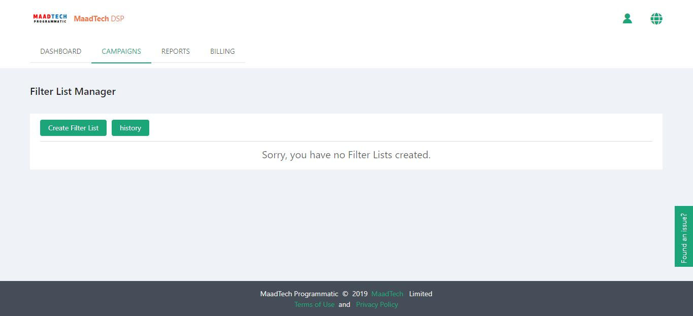
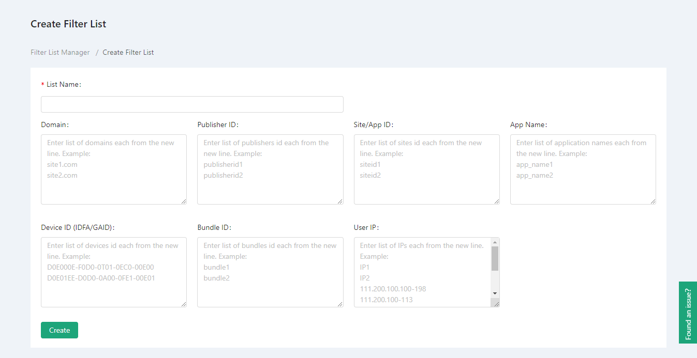
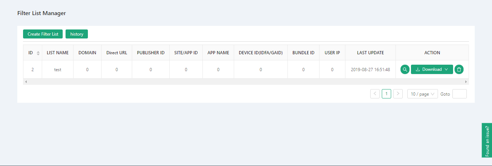
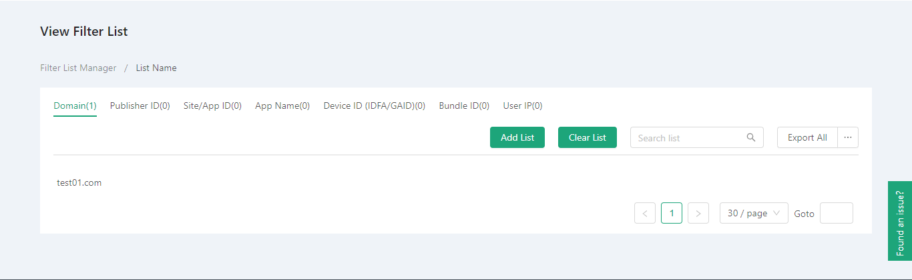
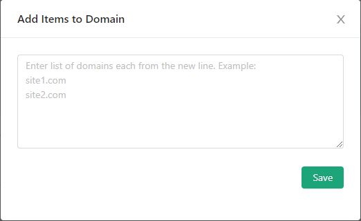
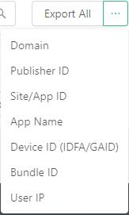
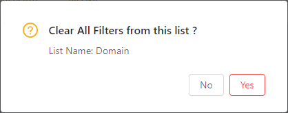
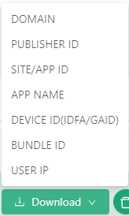
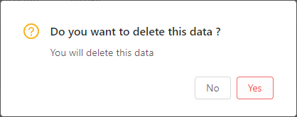

# Filter List Manager #
------------------
::: tip Filter List Manager
* A filter is a function of filtering a series of advertisements.
* We didn't initially have any list of filters
:::

## Create a list of filters

* Next we can create a filter and click the Create Filter List button.
* Then we jump to the page that creates the filter list.

* You can see the list name, domain name, publisher ID, website/application ID, application name, device ID (IDFA/GAID), bundle ID, user IP and other options.
* Add the corresponding filter according to our requirements

### Format Verification
------------------
::: warning Tip: Format validation occurs when creating filter lists
* The format of domain name is website 1.com website 2.com
* User IP format is 111.200.100.133
* The format of device ID is D0E01EE-D0D0-0A00-0FE1-00E01 D0E000E-F0D0-0T01-0EC0-00E00.
* List name is mandatory
* Fill in at least one item except the name of the list
:::

* After filling in, click the Create button, and we will complete the creation of a filter list!

## List of operational filters

### Filter list operation
------------------
::: tip The filter list table operation item has three functions respectively.
* View filter details
* Download filter list
* Delete filter list
:::

* Function 1: View filter details
* Click on the magnifying glass icon of the action item, and you will jump to the corresponding filter details page.

* The filter details page can view the corresponding data.

#### Filter Details Page Operation
------------------
::: tip Filter Details Page Operations Filter Details Page Operations, Functions are
* Adding filters
* Download filter
* Delete filter
* Cleaning filter
:::

1. Subfilters added to the filter details page
Click the button to add the list, and a pop-up box appears. According to the prompt format, enter the filter you want to add and click Save to add the filter.

2. Download the sub-filters of the filter details page
Mouse to all exported buttons, there is a drop-down box, you can choose the filter you want to download, you can also export all downloads.

3. Delete sub-filters from the filter details page
Mouse into the filter list item, there is a delete icon, click Select

Click on the delete icon to display three action buttons

> * Delete Selected: Delete Selected Filter List
> * Deselect All : Cancel the Selected Filter List
> * Show Selected: Show a list of selected filters

* Click Delete Selection, a confirmation deletion dialog box will pop up. If you confirm the deletion filter list, point confirmation will be made. If you do not want to cancel the deletion point, point confirmation will not be deleted.

4. Clean the sub-filters of the filter details page
Click on the empty list button, and a bullet box appears. If you confirm the empty filter list, point to confirm. If you do not want to cancel the empty list, it will not empty.

* Function 2: Download filter
* You can download the list of filters by clicking on the download icon option of the action item. Like the list of sub-filters, we can download all of them, or download only one item.

* Function 3: Delete filters
* Click on the action item to delete the trash can icon, you can delete the list of filters. Like deleting the list of sub-filters, a dialog box will pop up to confirm deletion. If you confirm deletion of the list of filters, point confirmation will be made. If you do not want to delete point cancellation, point confirmation will not be deleted.

