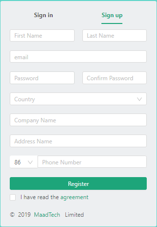
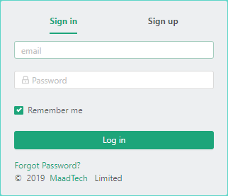
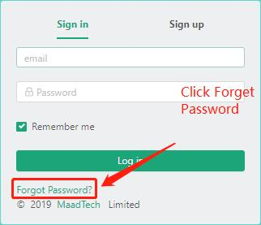
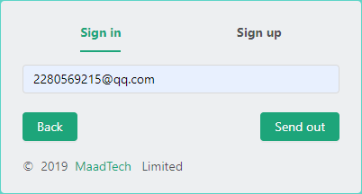
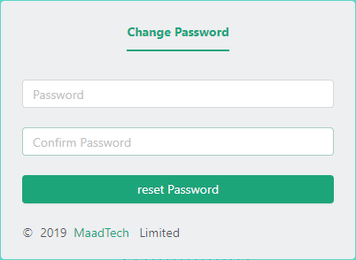

# Create a new user #
------------------
::: tip Creation steps
* Registered Account.
* Login account.
:::

## Registered Account
* First, let's take a look at the registration page.

* Registration page:

#### Registration steps
------------------
>* Input in turn
>* First Name,Last Name
>* E-mail
>* Possword,Confirm password
>* Choosing a country
>* Company Name,Address Name,Phone Number
>* Finally, check out the terms of service to complete registration

#### Format Verification
------------------
::: warning Tip: Format validation will occur during registration
* First Name,Last Name format can only contain English letters or Chinese without spaces
* The format of e-mail is standard e-mail format xxx@xx.com.
* Password. Confirm that the password is in the form of a number and a lowercase letter in English and is between 6 and 15 characters in length. Confirm that the password is the same as the previous password entered.
* Country, company, address input can not be empty
* Phone Number format is standard 11-digit mobile phone number
* All of the above options must be entered but not empty.
:::

## Login account
* After registering, we will jump to the corresponding login interface.

* Login interface:

#### Login steps
------------------
>* Input in turn
>* E-mail
>* Possword
>* Check whether to remember the account

#### Format Verification
------------------
::: warning Tip: Format validation will occur during login
* The format of e-mail is standard e-mail format xxx@xx.com and is consistent at the time of registration.
* The format of the password is to contain numbers and lowercase letters in English and the length is between 6 and 15 characters. It should also be the same as when registering.
:::

## Forget the password
* If we forget the password at the time of registration, we can click on the forgotten password on the login page.

* Then we jump to the page where we forgot the password.

* Enter our mailbox account, click the confirmation send button. After sending, our confirmation button will become sent. At this time, please open your email account and check the mail.
* We sent you an e-mail with a validated reset password.

* Click the Reset Password button and you will jump to the password modification interface.

* Enter the password and confirmation password you want to change, and you can change it successfully!