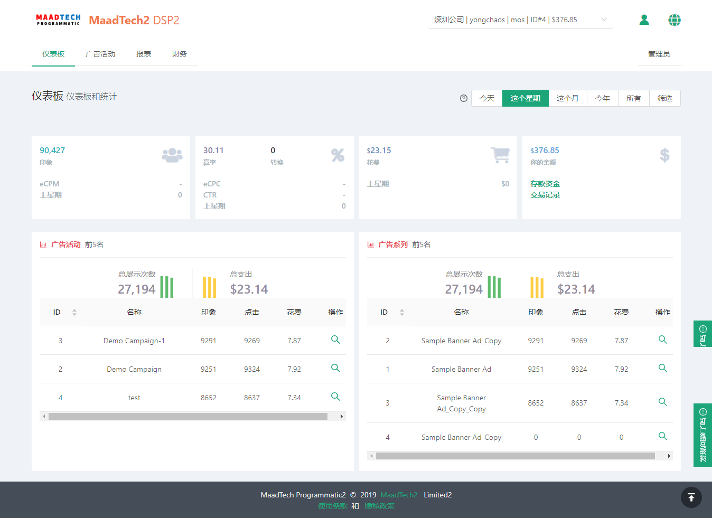
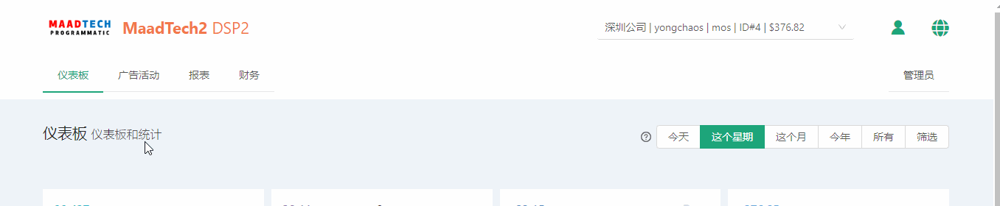

# 仪表盘 #
------------------
::: tip 仪表盘
* 仪表盘模块，这个模块我们查看总体账号信息
* 主要分为三部分
* 主页头部
* 仪表盘信息
* 主页页尾
:::

* 整体页面

## 主页头部
> * 导航菜单栏
> * 账户信息栏
> * 个人信息
> * 语言选择
> * 管理员

### 导航菜单栏
* 导航菜单栏，可以通过点击跳转到不同模块的

### 账户信息栏
* 账户信息栏，可以查看账户信息，以及切换账户

### 个人信息

#### 点击我的个人资料会跳转到个人信息页面

#### 点击退出登录会跳转到登录界面

### 语言切换

### 管理员
* 管理员权限由高级账号开通权限，普通用户没有

## 仪表盘信息

::: tip 小提示
* 余额中的存款资金和交易纪录点击后可以跳转到对应的账单模块和交易历史纪录模块
* 前五广告活动和广告系列表格的放大镜点击可以跳转到对应的详细报表界面
:::

## 主页尾部
* 主要是展示公司信息和版权信息标注
* 以及使用条款和隐私政策的

