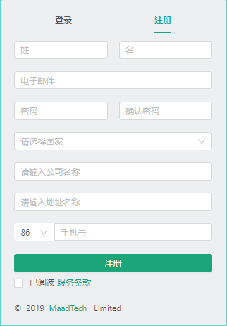
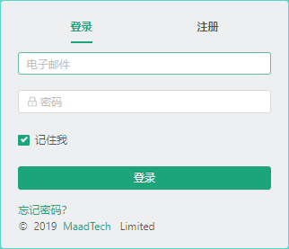
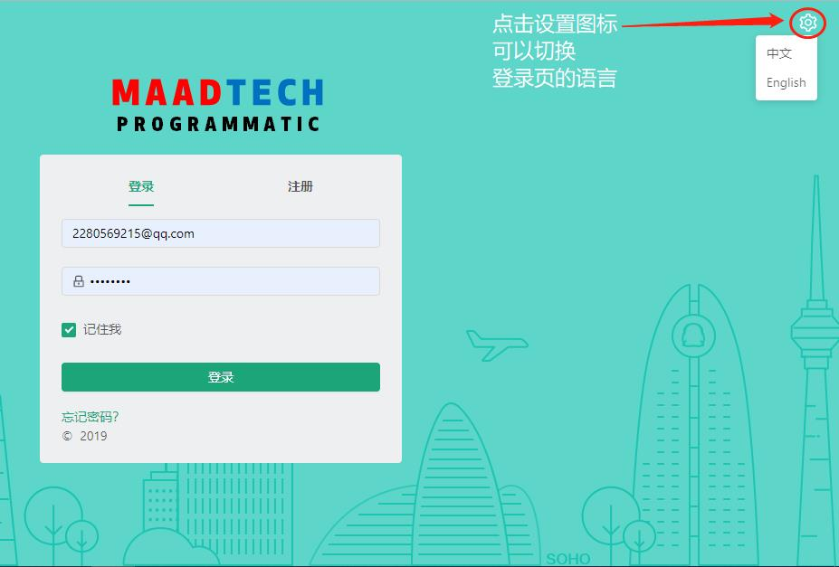
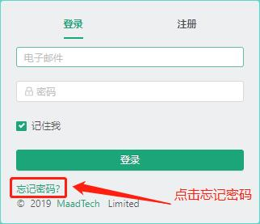
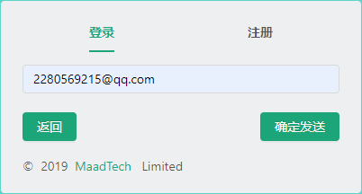
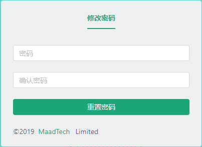

# 创建一个新用户 #
------------------
::: tip 创建步骤
* 注册账号.
* 登录账号.
:::

## 注册账号（若无此功能需联系管理员用户开通注册账号功能）
* 首先我们来看一下注册账号的页面

* 注册页面：

#### 注册步骤
------------------
>* 依次输入
>* 姓氏,姓名
>* 电子邮箱
>* 密码,确认密码
>* 选择国家
>* 公司，地址，手机号
>* 最后勾选服务条款完成注册

#### 格式验证
------------------
::: warning 提示: 注册时会有格式验证
* 姓氏,姓名的格式只能包含英文字母或中文且不能有空格
* 电子邮箱的格式为标准电邮格式xxx@xx.com
* 密码,确认密码的格式为包含数字和英文小写字母且长度在6-15个字符之间，确认密码要跟之前输入的密码一致
* 国家，公司，地址输入都不能为空
* 手机号格式为标准的11位手机号码
* 以上选项都必须输入不能为空
:::

## 登录账号
* 完成注册以后我们会跳转到对应的登录界面

* 登录界面:

#### 登录步骤
------------------
>* 依次输入
>* 电子邮箱
>* 密码
>* 可勾选是否记住账号

#### 格式验证
------------------
::: warning 提示: 登录时会有格式验证
* 电子邮箱的格式为标准电邮格式xxx@xx.com且为注册时的一致
* 密码的格式为包含数字和英文小写字母且长度在6-15个字符之间，也要和注册时的一致
:::

* 小提示：登录注册页可以切换语言

## 忘记密码
* 如果我们忘记了注册时的密码，那么我们可以点击登录页面上面的忘记密码

* 之后我们会跳转到忘记密码对应的页面

* 输入我们的邮箱账号，点击确认发送按钮，发送以后我们的确认按钮会变成已发送，这个时候请打开你电子邮箱的账号，查看邮件
* 我们给您发送了一封验证的重置密码的电子邮件

* 点击重置密码按钮，就会跳转到修改密码的界面

* 输入想要更改的密码和确认密码就可以修改成功了！