# 广告活动 #
------------------
::: tip 广告活动
* 广告活动模块，这个模块我们可以创建广告活动和广告系列
* 我们初始时没有任何广告活动列表的
:::

初始界面：

## 添加广告活动列表

* 下面我们可以去添加一个广告活动，点击添加广告活动按钮
* 然后我们就会跳转到添加广告活动那个的页面

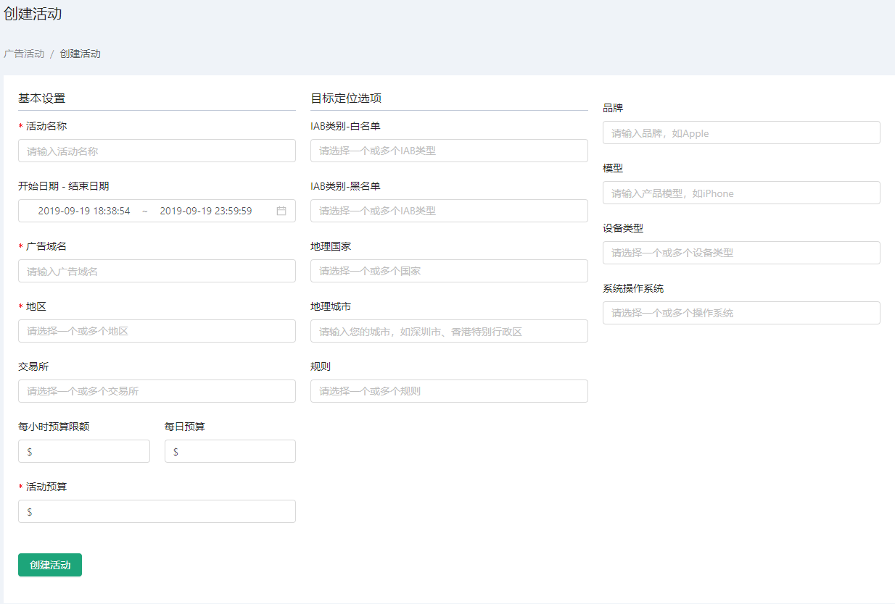

* 可以看到有活动名称，开始日期-结束日期，广告域名，地区，交易所，碎片，小时预算，每日预算等添加项
* 根据我们的需求来添加广告活动

#### 格式验证
------------------
::: warning 提示: 创建广告活动列表时会有格式验证
* 每小时预算限额，每日预算，活动预算必须输入数字
* 开始日期初始为跳转到创建活动页面的时间点，不能选择其之前的时间
* 带*号的添加项为必填项
* 其他的选项根据提示信息进行填写
:::

* 填写完需要的选项后我们可以点击创建活动按钮，这时我们会跳转到广告系列的创建页面

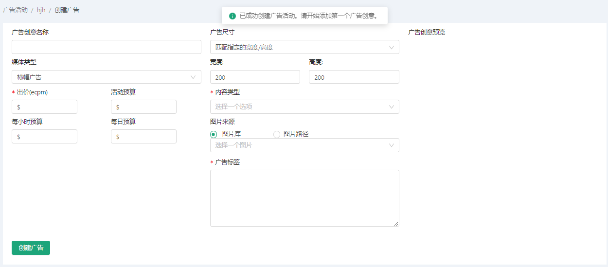

* 我们可以选择继续创建活动对应的广告系列也可以选择返回到广告活动的页面

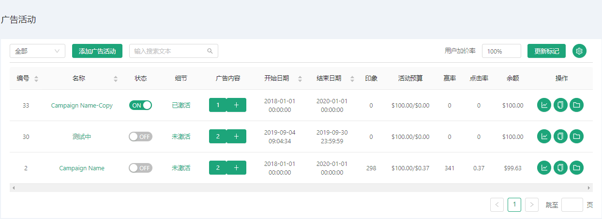

## 操作广告活动列表

### 活动列表页操作
* 我们可以看到广告活动页表格有一个操作项
::: tip 广告活动页表格操作项，有三个功能分别
* 查看活动报表
* 复制广告活动
* 归档广告活动
:::

#### 功能1: 查看活动报表
* 此功能是查看广告活动对应的详细报表数据
* 点击操作项的折线图图标，就会跳转到对应的活动报表详情页面

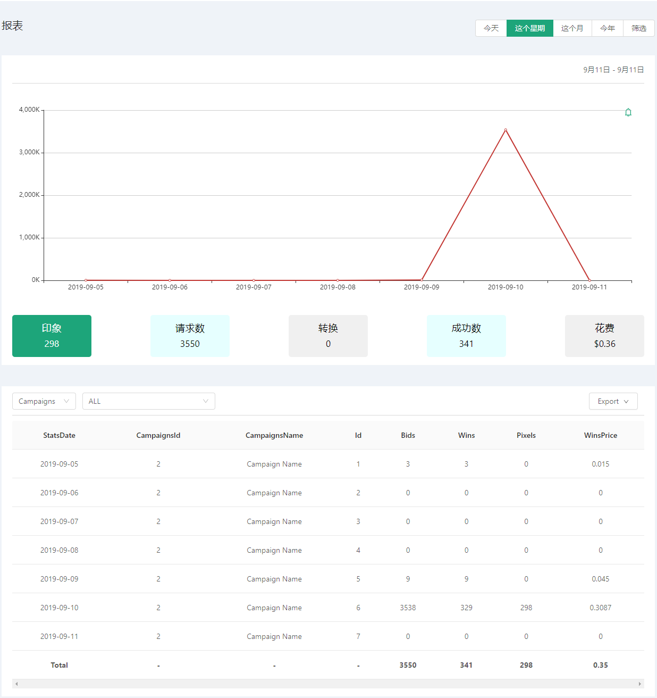

#### 功能2: 复制广告活动
* 此功能是对广告活动进行复制
* 点击操作项的复制图标，出现一个弹框

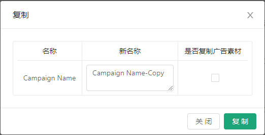

* 弹框里有一个复制广告活动的表格，有名称和新名词以及是否复制广告素材等3个列表项
* 新名称是复制后的广告活动名称，我们可以自己编辑新名称或者使用默认的-Copy后缀作为区分
* 是否复制广告素材，如果勾选中，那么被复制的广告活动里面通过审核的广告系列也会被一起复制过去
* 点击复制按钮，等待几秒钟后，广告活动页表格会刷新

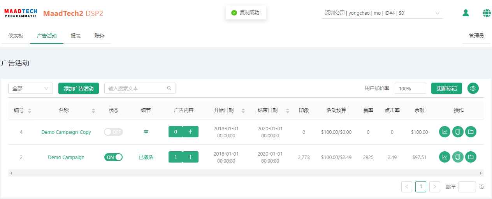

::: tip 友情提示
* 如果没有勾选复制广告素材或者勾选了但是被复制的广告活动没有通过审核的广告素材
* 那么复制的新广告活动，默认的广告系列是为空的
:::

#### 功能3: 归档广告活动
* 此功能是将广告活动归档（类似于删除功能，但会保留纪录）
* 点击操作项的文件夹图标，出现一个弹框

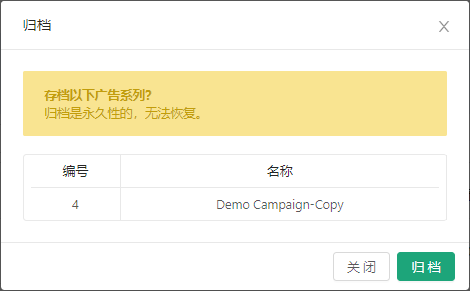

* 弹框提示您是否确定永久归档该广告系列，一旦归档，无法恢复
* 点击归档按钮，对广告活动进行归档，等待几秒钟后，广告活动页表格会刷新

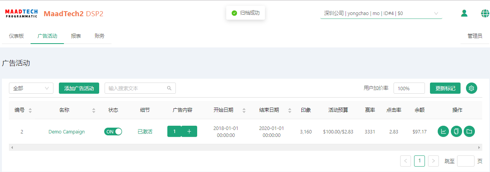

* 我们可以看到广告成功归档并且在广告活动页表格也已经看不到被归档的表格了

### 活动页筛选查询操作
* 我们可以通过广告活动页筛选查询已得到我们需要的信息
::: tip 广告活动页筛选查询操作，有三种方式
* 模糊查询广告活动表格
* 下拉框状态筛选
* 表头显示筛选
:::

#### 方式1: 模糊查询
* 输入关键字（关键字不区分大小写），回车，可以对表格的广告活动进行查询

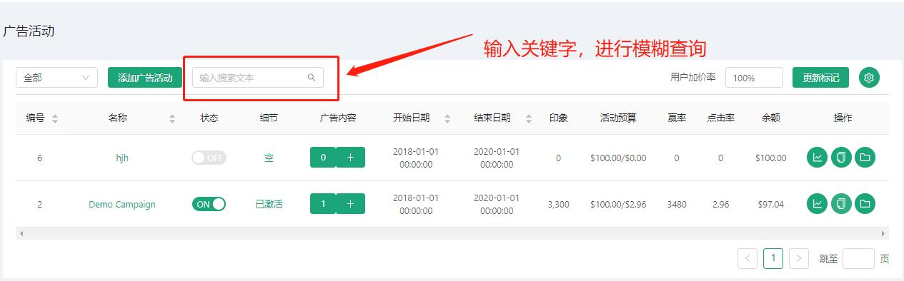

* 查询结果

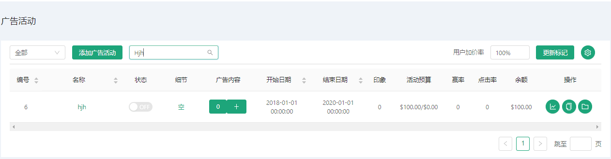

* 提醒： 如果不输入关键字直接查询的话，默认是刷新表格的

#### 方式2: 下拉框状态筛选
* 点击下拉框，有对应活动的状态选项，全部，已激活，未激活以及存档
* 点击对应的选项可以查看对应状态的活动

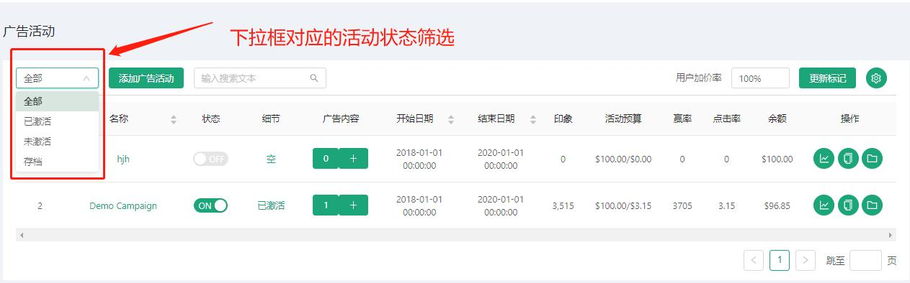

* 查询已激活
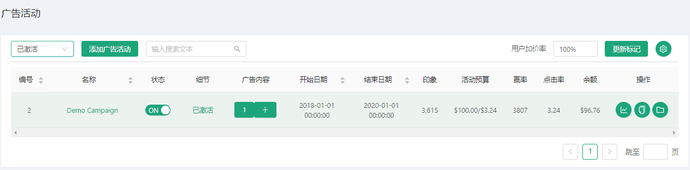

* 查询未激活
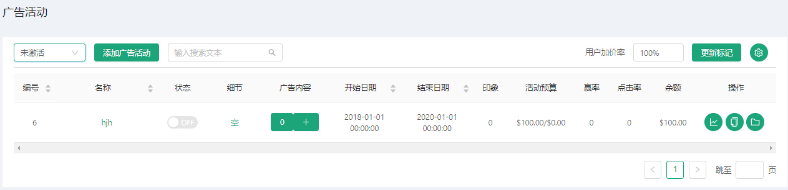

* 查询归档
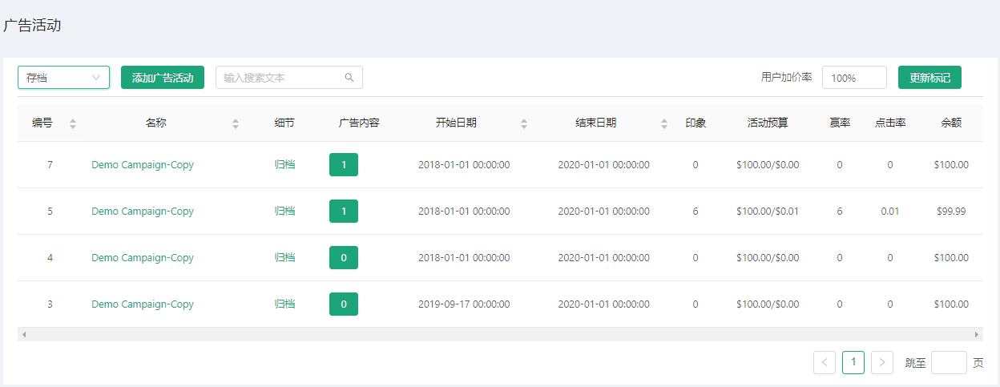

::: tip 温馨提示
* 查询归档的活动后，是不能进行表头显示筛选的
* 而且不能进行添加广告系列
* 点击广告内容，只能看到归档的广告，且点击广告名称只能查看广告活动的详情不能编辑保存
* 因为我们的广告活动被归档后数据存档，是不可更改的
:::

* 查询全部（就是查询除归档以外所有状态的活动）

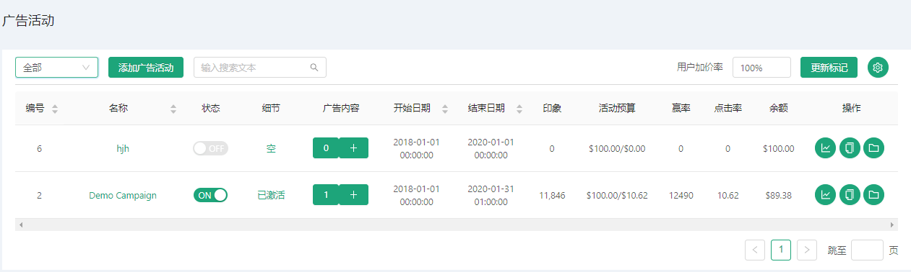

#### 方式3: 表头显示筛选
* 点击设置图标小按钮，会出现表头的多选框组

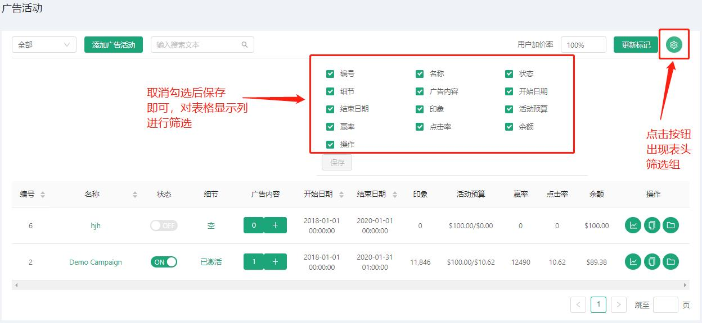

例如: 隐藏显示活动预算项

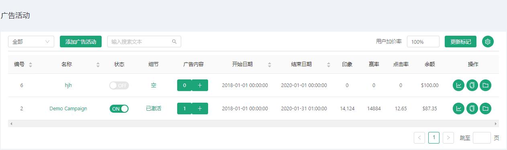

### 活动页表格编辑查看操作
::: tip 广告活动页编辑查看操作
* 编辑广告活动
* 查看及添加广告系列
* 更改广告活动状态
:::

#### 操作1: 编辑广告活动
* 点击广告活动的名称可以跳转到广告活动的编辑页

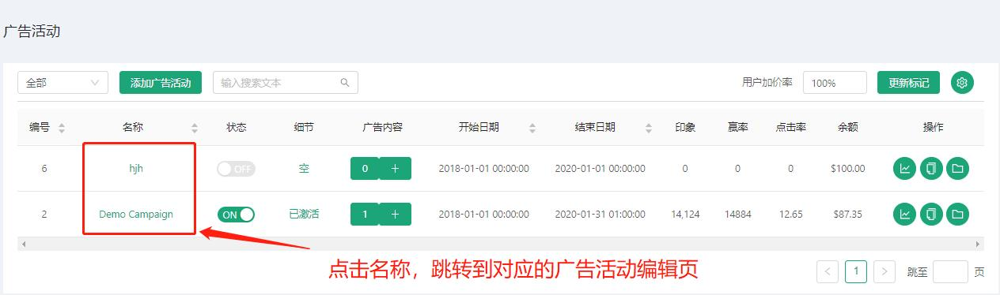

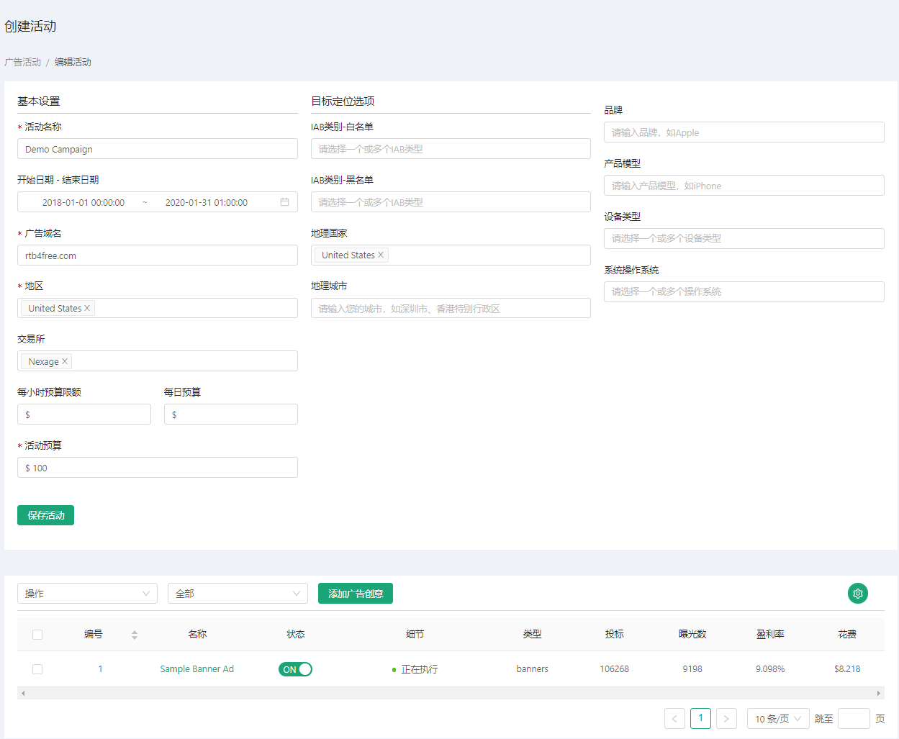
* 请注意 我们跳转到编辑广告活动页，下方有活动系列的列表。
* 这是因为我们点击的广告活动里面有广告系列，所以才会在编辑活动的下方呈现出来。
* 我们在编辑完成后点击保存活动即可，会跳转回我们的广告活动页，并且页面会进行刷新。

#### 操作2: 更改广告活动状态
* 点击广告活动的开关可以开启关闭广告活动的状态
* 提醒： 如果该广告活动里面没有广告系列或者该广告活动的余额不足是无法开启广告活动的状态的
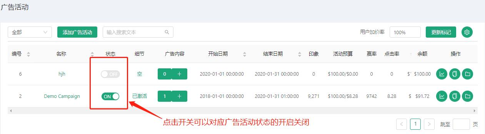

#### 操作3: 查看广告系列详情及添加广告系列
* 点击广告内容，是查看该广告活动的广告系列详情
* 点击广告内容的添加按钮，是对该广告活动添加广告系列
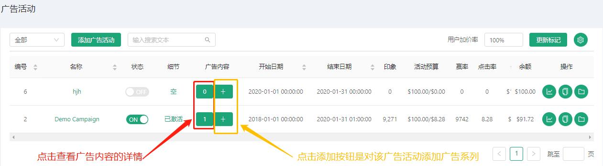

* 这部分操作我们在广告系列里面再详解