# 广告系列 #
------------------
::: tip 广告系列
* 广告系列模块，这个模块我们可以创建以及操作广告系列
* 我们广告活动初始创建时没有任何广告系列的
* 我们可以通过点击广告活动表格项的广告内容来查看我们的广告系列
:::

初始界面：

## 添加广告系列页列表

* 下面我们可以去添加一个广告系列，点击添加广告创意按钮
* 然后我们就会跳转到添加广告系列那个的页面

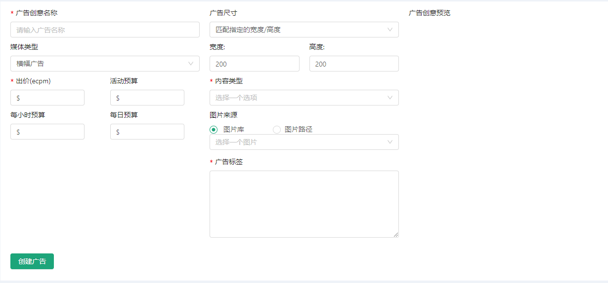

#### 格式验证
------------------
::: warning 提示: 创建广告系列时会有格式验证
* 每小时预算，每日预算，活动预算，出价（ecpm）必须输入数字
* 广告名称，出价，内容类型，图片来源等为必填字段
* 带*号的添加项为必填项
* 其他的选项根据提示信息进行填写
:::

* 我们可以选择添加图片广告或者视频广告
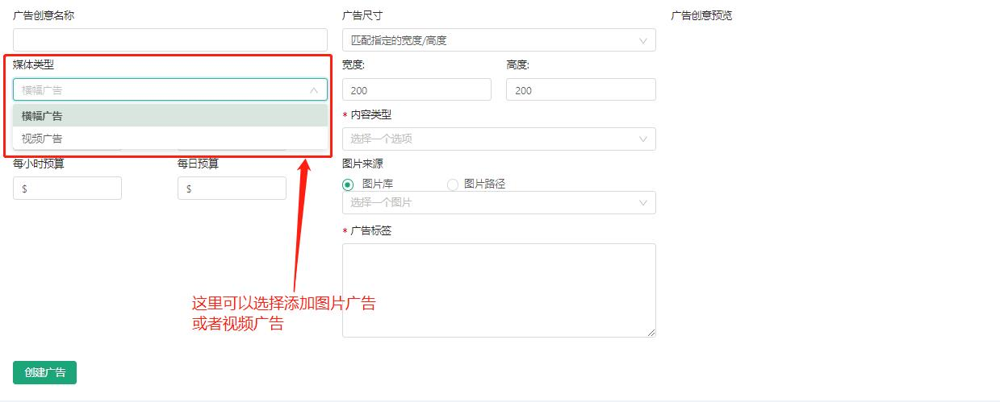

### 添加图片广告

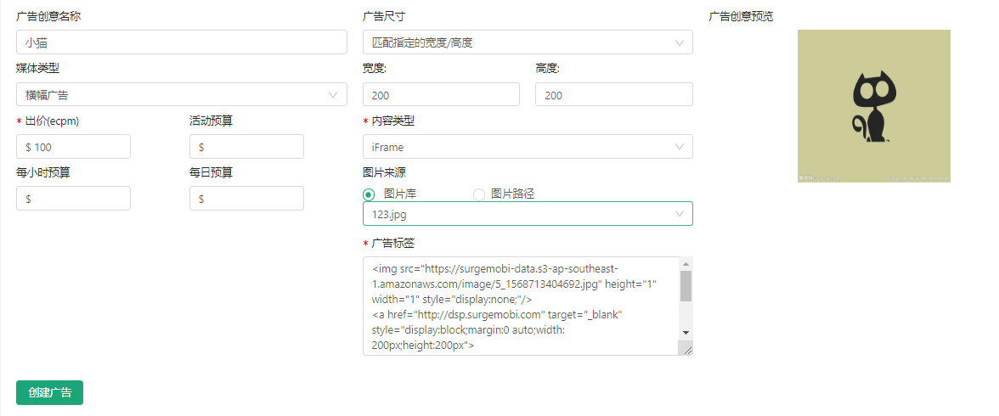

* 添加图片我们有2种形式，使用图片库里的图片添加
* 或者在输入一个网上的图片链接进行添加
* 我们默认使用图片库里面的图片进行添加
* 图片库怎么添加图片，会在后面的文件收藏夹模块中说明
* 点击创建广告即可

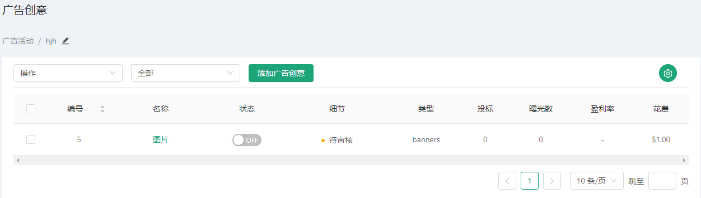

### 添加视频广告

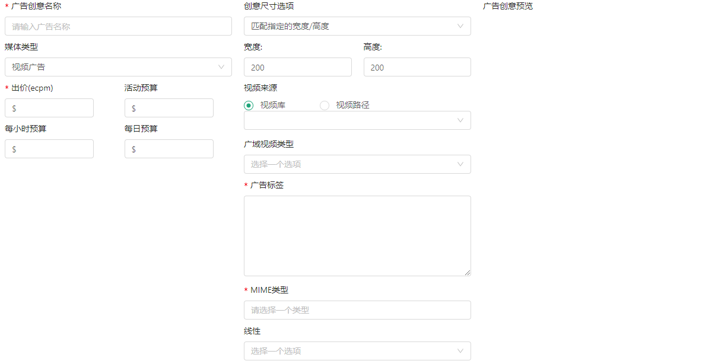

* 添加视频广告的形式和图片一样
* 填写完对应字段

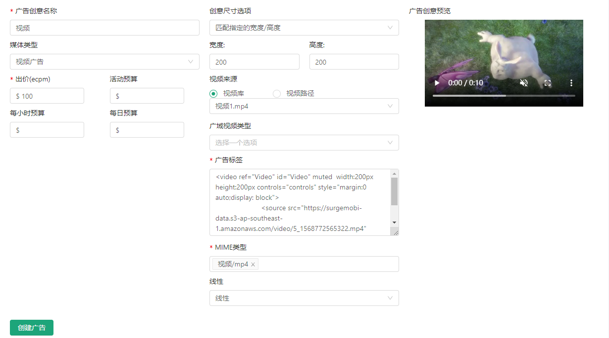

* 点击创建广告即可

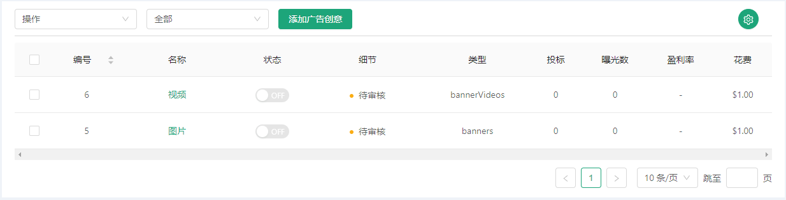

::: tip 关于广告系列的状态
* 我们的广告系列有5种状态
* 分别是待审核，可执行，正在执行，有误以及归档
* 待审核： 所有新创建的广告系列初始的状态，以及通过审核后复制的新广告也是待审核状态。
* 可执行： 我们开通管理员权限后可以去到审核广告模块对广告进行审核，通过审核以后的广告为可执行状态
* 正在执行： 可执行状态的广告开启状态为正在执行状态
* 有误： 在审核广告模块对广告不通过审核，则为有误状态
* 归档： 当其所在的广告活动为归档状态时，其下所属广告系列都为归档状态
:::

## 操作广告系列页列表

::: tip 广告系列操作
* 广告系列状态筛选
* 广告系列状态多启动/关闭/复制
* 广告系列表头筛选
:::

#### 操作1: 广告系列状态筛选
* 点击下拉框，有对应广告系列的状态选项，全部，已激活，未激活以及待审核
* 点击对应的选项可以查看对应状态的广告系列

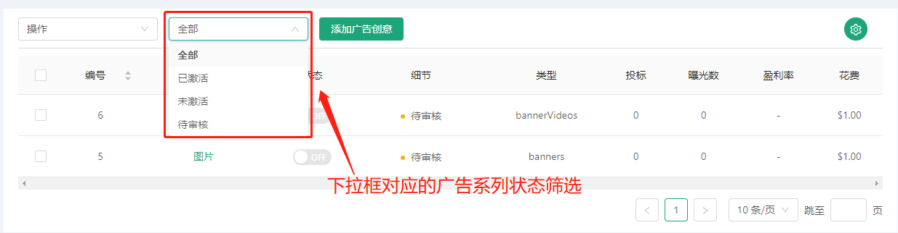

* 查询已激活
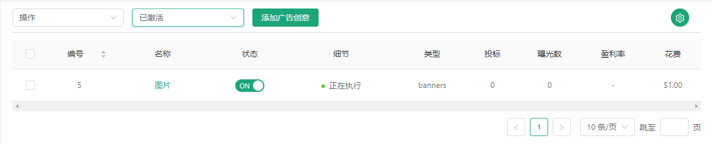

* 查询未激活
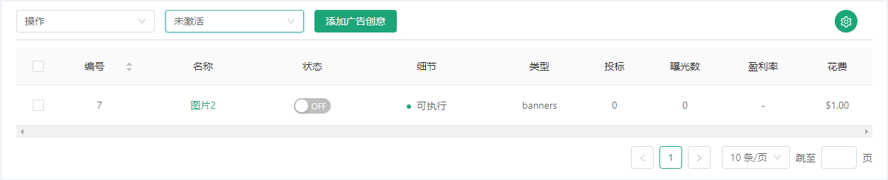

* 查询待审核
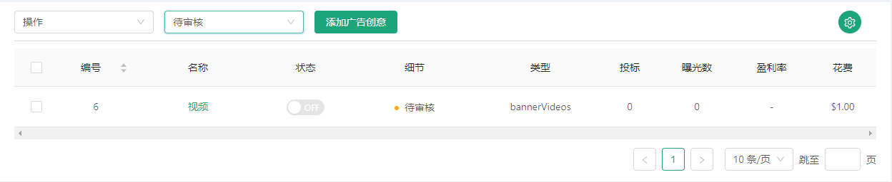

* 查询全部（就是查询所有状态的广告系列）
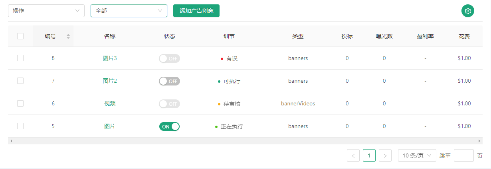

* 提醒：查询对应状态的广告系列，如果没有该状态的广告系列，是查询不到数据的

#### 操作2: 广告系列状态复制，多启动/关闭
* 点击下拉框，有对应广告系列的状态操作，复制，开始选择启动，结束选择关闭
* 点击对应的选项可以实现对应的操作
* 要配合下方的多选框

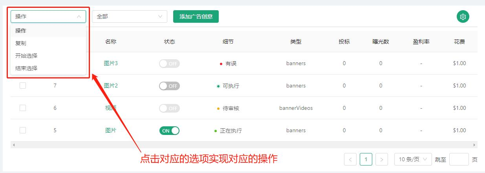

##### 复制
>* 复制广告系列
>* 全选或者选择想要复制的广告系列点击对应的下拉框选项
>* 会弹出复制广告系列的弹框

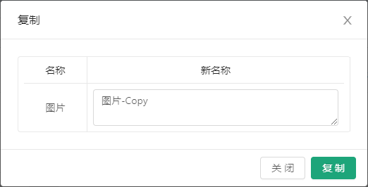

* 还可以选择多个广告系列一同复制

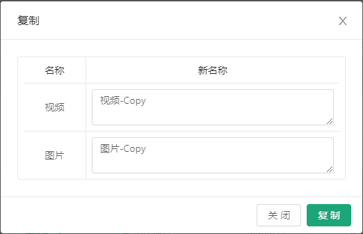

* 点击复制就可以实现复制了，页面会刷新

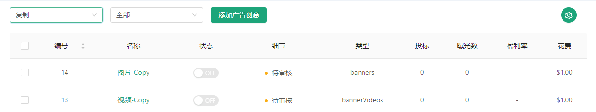

* 提醒： 就算是已通过审核或者正在执行的广告系列，复制过后状态也会变成待审核的

##### 多广告启动
>* 同时开启广告系列
>* 全选或者选择想要开启的广告系列点击对应的下拉框选项
>* 等待几秒就可以启动了

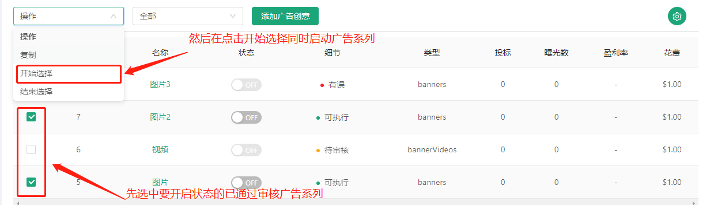

##### 多广告关闭
>* 同时关闭广告系列
>* 全选或者选择想要关闭的广告系列点击对应的下拉框选项
>* 等待几秒就可以关闭了

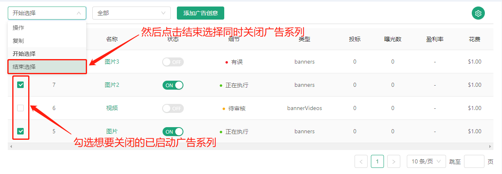

#### 方式3: 表头显示筛选
* 点击设置图标小按钮，会出现表头的多选框组
* 与广告活动模块的功能相同

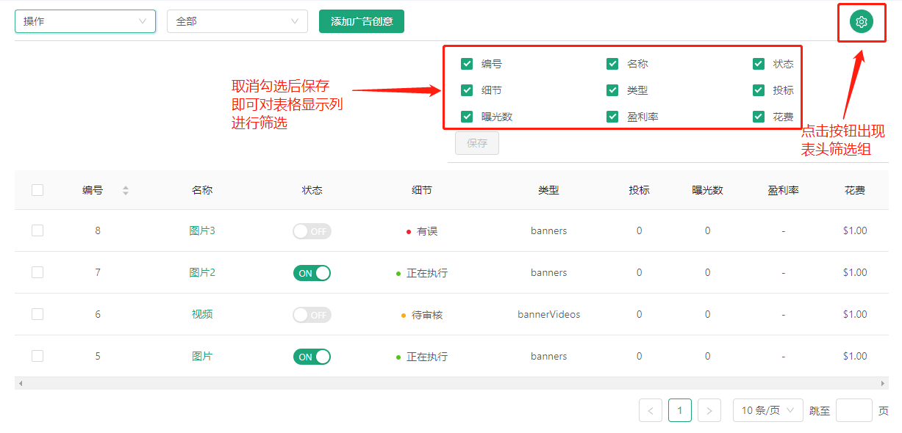

## 编辑查看广告系列页列表
::: tip 广告活动页编辑查看操作
* 编辑广告系列
* 更改广告系列状态
:::

#### 操作1: 编辑广告活动
* 点击广告系列的名称可以跳转到广告系列详情的编辑页

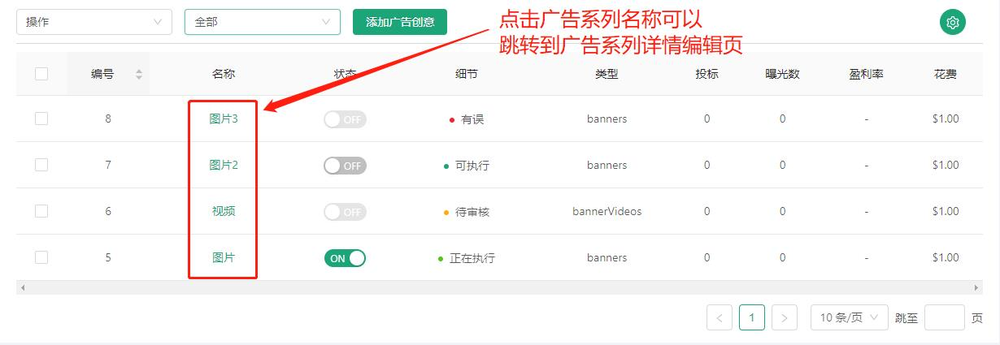

* 我们在编辑完成后点击保存广告即可，会跳转回我们的广告活动页，并且页面会进行刷新。

#### 操作2: 更改广告系列状态
* 点击广告活动的开关可以开启关闭广告活动的状态
* 提醒： 如果该广告活动里面没有广告系列

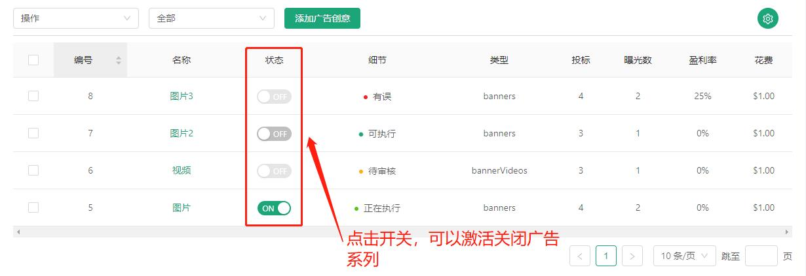

