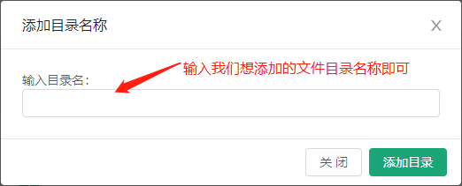
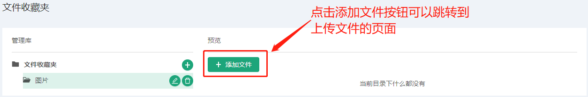

# 文件收藏夹 #
------------------
::: tip 文件收藏夹
* 文件收藏夹是我们存储我们的广告资源的地方
* 添加后可以在广告系列对应的视频或图片广告中引用
* 我们初始时没有任何文件夹列表的
:::

初始界面：

## 添加文件收藏夹列表

* 下面我们可以去添加一个文件夹，点击添加文件夹旁的按钮
* 然后会出现一个添加文件目录的弹框

* 添加完成后可以选中新添加的文件夹

* 我们可以看到显示当前目录下什么都没有，需要我们去添加文件资源
* 点击添加文件资源，会跳转到添加文件资源的页面

### 添加图片资源

*    wqwq

### 添加视频资源

