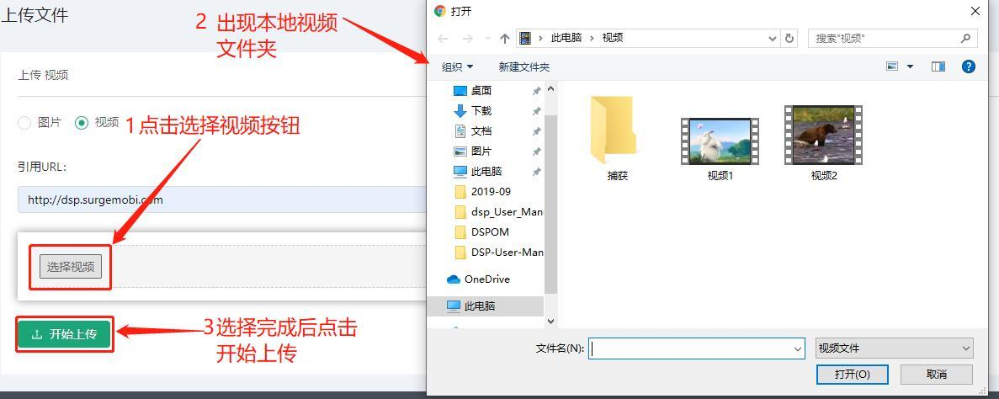

# 文件收藏夹 #
------------------
::: tip 文件收藏夹
* 文件收藏夹是我们存储我们的广告资源的地方
* 添加后可以在广告系列对应的视频或图片广告中引用
* 我们初始时没有任何文件夹列表的
:::

初始界面：

## 添加文件收藏夹列表

* 下面我们可以去添加一个文件夹，点击添加文件夹旁的按钮
* 然后会出现一个添加文件目录的弹框

* 添加完成后可以选中新添加的文件夹

* 我们可以看到显示当前目录下什么都没有，需要我们去添加文件资源
* 点击添加文件资源，会跳转到添加文件资源的页面

### 添加图片资源

* 我们输入完url链接和图片的文本信息后
* 点击选择图片按钮，会出现本地图片文件夹
* 我们选择我们想要添加的图片后再点击开始上传按钮
* 等待几秒就添加成功了

### 添加视频资源

* 我们输入完url链接后
* 点击选择视频按钮，会出现本地视频文件夹
* 我们选择我们想要添加的视频后再点击开始上传按钮
* 等待几秒就添加成功了

* 添加完成后我们可以看到文件夹的资源信息

## 操作文件收藏夹列表
::: tip 文件收藏夹操作
* 编辑/删除文件信息
* 编辑/删除文件夹信息
:::

#### 操作1: 编辑/删除文件信息

* 编辑文件信息
* 点击文件资源信息的编辑图标，出现编辑文件信息的弹框

* 编辑完成后点击保存就可以了

* 删除文件信息
* 点击文件资源信息的删除图标，出现删除文件信息的弹框

* 点击确定后就完成删除了

#### 操作2: 编辑/删除文件夹信息

* 编辑文件夹信息
* 点击文件夹的编辑图标，出现编辑文件夹目录的弹框
* 我们可以更改文件夹的名字

* 删除文件夹信息
* 点击文件夹的删除图标，出现删除文件夹目录的弹框
* 点击确认即可删除文件夹

* 删除完成后，图片文件夹消失

