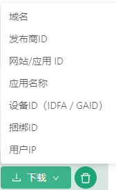

# 过滤器列表管理器 #
------------------
::: tip 过滤器列表管理器
* 过滤器是对广告进行一系列过滤操作的功能
* 我们初始时没有任何过滤器列表的
:::

初始界面：

## 创建过滤器列表

* 下面我们可以去创建一个过滤器，点击创建过滤列表按钮
* 然后我们就会跳转到创建过滤器列表的页面

* 可以看到有列表名称，域名，发布商ID，网站/应用 ID，应用名称，设备ID（IDFA / GAID），捆绑ID，用户IP等选项
* 根据我们的需求来添加对应的过滤器

### 格式验证
------------------
::: warning 提示: 创建过滤器列表时会有格式验证
* 域名的格式为网站1.com 网站2.com
* 用户IP的格式为111.200.100.133这种
* 设备ID的格式为D0E01EE-D0D0-0A00-0FE1-00E01 D0E000E-F0D0-0T01-0EC0-00E00
* 列表名称为必填项
* 除列表名称以外最少填写一项
:::

* 填写完毕后点击创建按钮，我们就完成一个过滤器列表的创建了！

## 操作过滤器列表

### 过滤器列表操作
------------------
::: tip 过滤器列表表格操作项，有三个功能分别
* 查看过滤器详情
* 下载过滤器列表
* 删除过滤器列表
:::

* #### 功能1: 查看过滤器详情
* 点击操作项的放大镜图标，就会跳转到对应的过滤器详情页面

* 过滤器详情页可以查看对应的数据

##### 过滤器详情页操作
------------------
::: tip 过滤器详情页操作，功能分别为
* 增加过滤器
* 下载过滤器
* 删除过滤器
* 清空过滤器
:::

1. 增加过滤器详情页的子过滤器
点击增加列表的按钮，出现一个弹框，按照提示的格式输入要添加的过滤器点击保存就可以添加过滤器了

2. 下载过滤器详情页的子过滤器
鼠标移入到全部导出的按钮，出现一个下拉框，可以选择想要下载对应的过滤器，也可以全部导出下载

3. 删除过滤器详情页的子过滤器
鼠标移入到过滤器列表项,有一个删除图标，点击选中

点击删除图标会出现3个操作按钮

> * 删除选中： 删除选中的过滤器列表
> * 取消全部选中： 取消选中的过滤器列表
> * 展示选中： 展示已选中的过滤器列表

* 点击删除选中，会弹出一个确认删除的对话框，如果您确认删除过滤器列表就点确认，如果不想删除点取消就不会删除了。

4. 清空过滤器详情页的子过滤器
点击清空列表的按钮，出现一个弹框，如果您确认清空过滤器列表就点确认，如果不想清空点取消就不会清空了。

* #### 功能2: 下载过滤器
* 点击操作项的下载图标选项，就可以下载过滤器列表了，同理和下载子过滤器列表一样，我们也可以选择全部下载，或者只下载单项

* #### 功能3: 删除过滤器
* 点击操作项的删除垃圾桶图标，就可以删除过滤器列表了，同理和删除子过滤器列表一样，会弹出一个确认删除的对话框，如果您确认删除过滤器列表就点确认，如果不想删除点取消就不会删除了。

