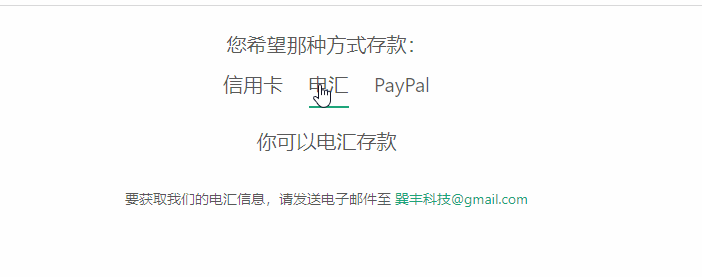

# 基本财务 
::: tip 个人账户及余额充值
* 此页面主要为用户提供查看个人余额等信息服务
* 可设置到账邮箱提示和用户自定义付款方式
:::

### 查看当前用户所剩余额
---
* 页面中间处展示是您个人余额(美元形式)
* 在下方选项按钮点击可通过邮件提示功能，到账及时发送邮件通知您

### 自定义付款功能
---
* 此功能有系统默认选择3个付款功能给用户（行用卡、电汇、PayPal）
* 如用户想要其他付款可在管理员权限下编辑设置您想要付款功能 

关于编辑自定义付款请查看 [编辑付款]()
