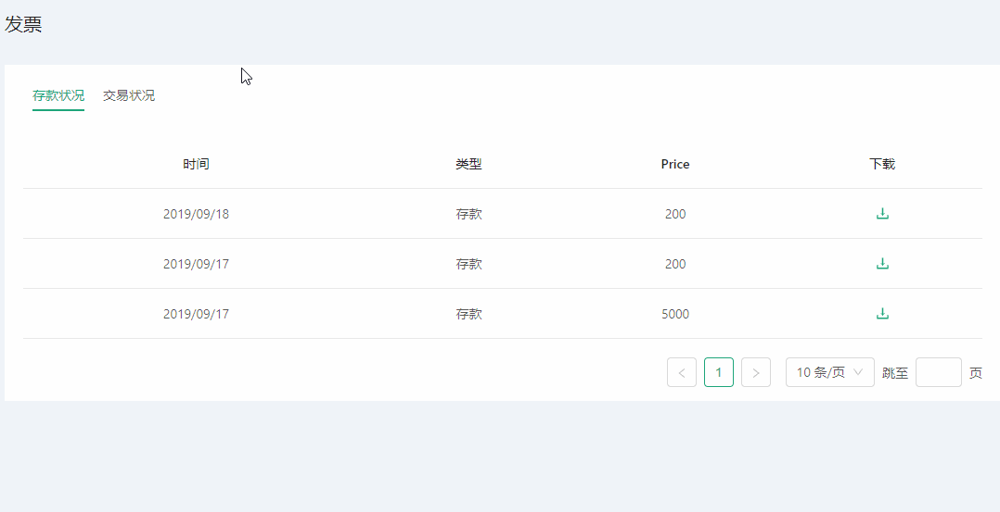
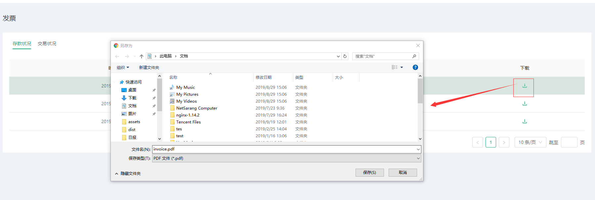
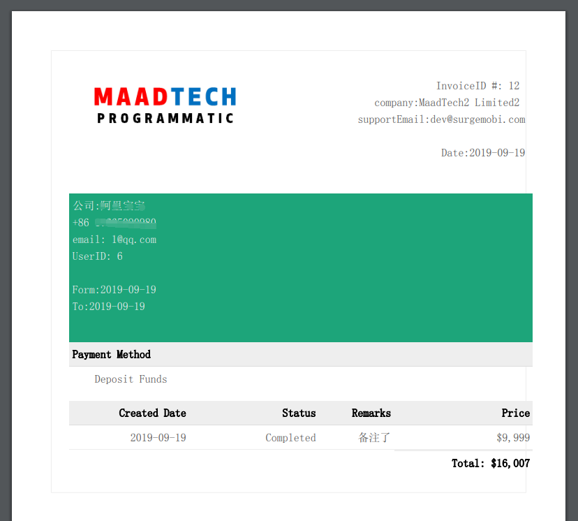

# 财务发票 
::: tip 个人账户及余额充值
* 此页面主要为用户提供财务发票及订单
* 用户可即可或操作下载
:::

### 查看存款及交易情况
---
* 页面有两项选择分别是存款情况和交易情况用户可在两着随意点击切换查询您想要信息
* 在数据量多时可提供分页展示，将所有数据分为N页展示，用户可指定跳转页数

#### 发票下载
---
* 在每项表格数据末尾处提供该行数据的发票下，用户单击即可，等待一会着则浏览器会自动弹出文件目录，用户选择指定目录即可下载
* 下载以PDF格式提供下载

下载之后展示效果

