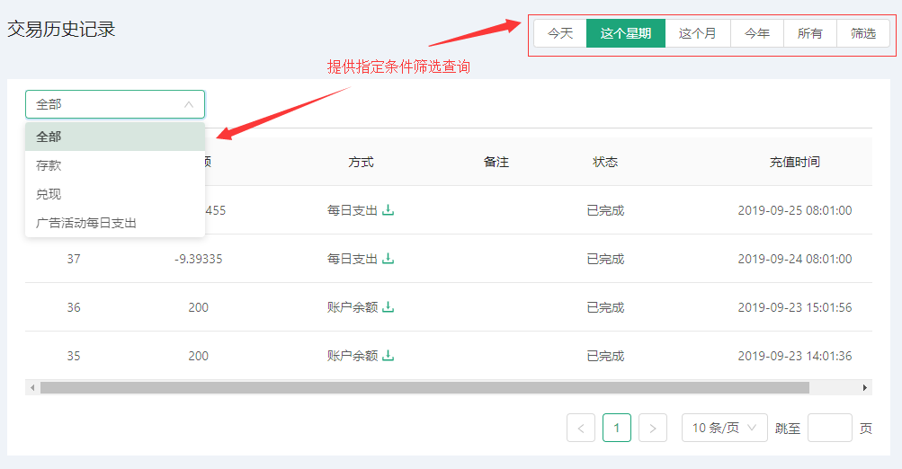

# 交易历史记录 
::: tip 用户莫个时间段所交易情况记录
* 此页面为用户提供按日期及交易类型添加查询数据服务
* 用户可灵活查询个人所有历史以来的交易情况
:::

### 查看交易
---
* 点击日期范围添加，可定位到指定日期范围
* 点击交易类型下拉框可选择用户需要查询的类型，条件筛选好之后点击查询即可看到对应的数据
* 当数据量过多时可自动提供分页查询功能

### 下载历史交易发票
---
* 图中表格在每一项之中‘方式’项处可点击下载图标进行下载该条记录发票(如下图)：

下载之后更多详情请查看 [发票下载](Invoice.html#发票下载)
