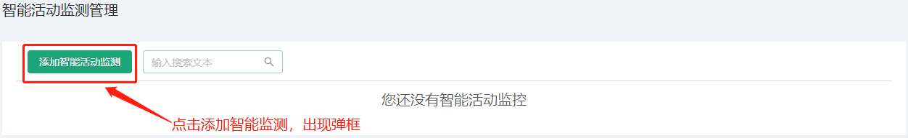
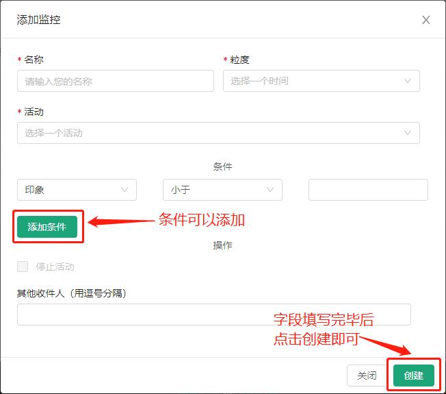
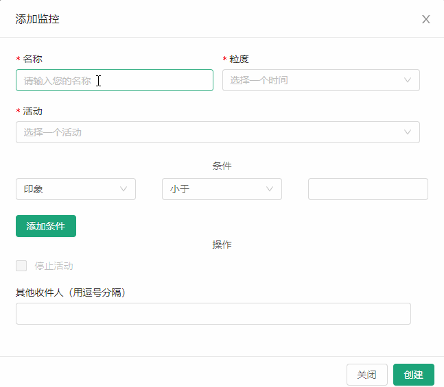
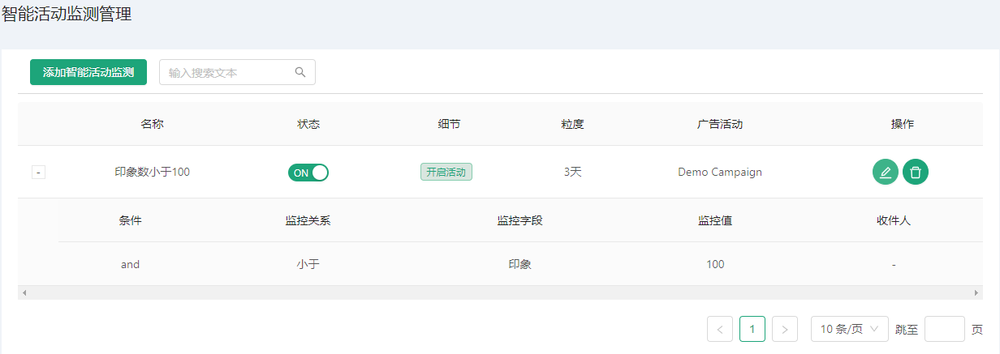
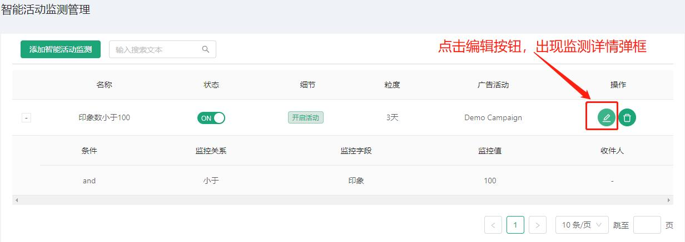
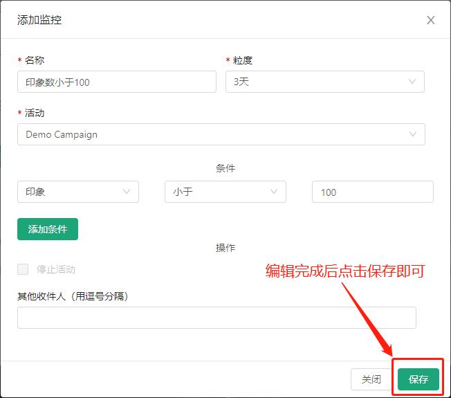
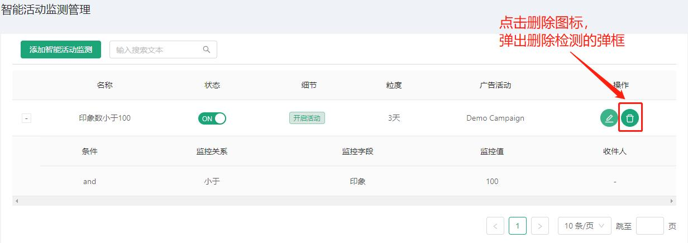
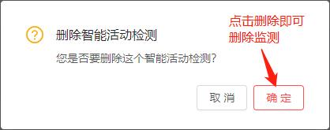
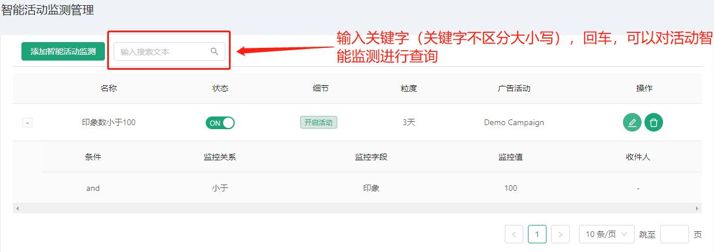

# 活动智能监测 #
------------------
::: tip 活动智能监测
* 活动智能监测，这个模块我们可以创建以及操作活动智能监测
* 活动智能监测是对广告活动做一个监测绑定的作用
* 初始我们是没有任何活动监测的
* 我们可以通过点击活动监测页面的添加按钮来添加活动智能监测
:::

初始界面：

## 添加活动监测
* 点击活动监测页面的添加按钮来添加活动智能监测
* 出现添加的弹框

* 添加过程

* 添加完成后活动监测表格会更新

## 操作活动监测
::: tip 活动智能监测操作
* 编辑活动智能监测
* 删除活动智能监测
* 查询活动智能监测
:::

#### 操作1: 编辑活动智能监测
* 表格操作项点击编辑图标按钮，弹出对应的活动监测详情弹框
* 编辑完成后点击保存按钮就可以成功编辑

#### 操作2: 删除活动智能监测
* 表格操作项点击删除图标按钮，弹出删除活动监测的弹框
* 点击确认按钮就可以删除活动监测了

#### 操作3: 查询活动智能监测
* 输入关键字（关键字不区分大小写），回车，可以对活动智能监测进行查询

