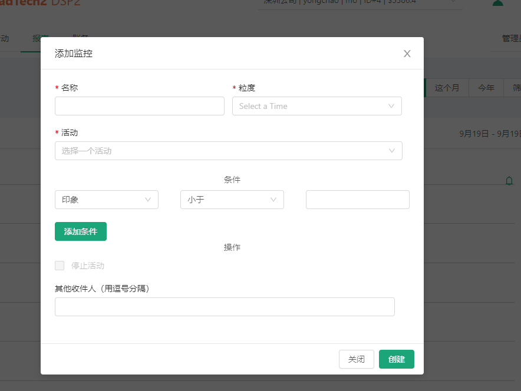

# 基本表报 
::: tip 广告等信息表报
* 此页面为广告活动及系列相关数据以图表折线图展示
* 让用户通过图表折线图充分看出每个时间段比例
:::

### 查看活动报表
---
* 此功能是查看广告活动及广告系类对应的详细报表数据
* 点击左上方可筛选出不同时间段直接的数据展示

分别可以点击：印象、&nbsp;&nbsp;&nbsp;请求数、&nbsp;&nbsp;&nbsp;转换(开发中)、&nbsp;&nbsp;&nbsp;成功数、&nbsp;&nbsp;&nbsp;花费，查看时间条件中的数据信息

### 添加活动监控
---
* 点击图表中小铃铛(添加智能监控)
* 点击后会弹出模态框，用户可输入或选择相关信息后点击创建

关于添加智能活动详细信息请查看 [添加活动智能监控](http://jianshu.com)
