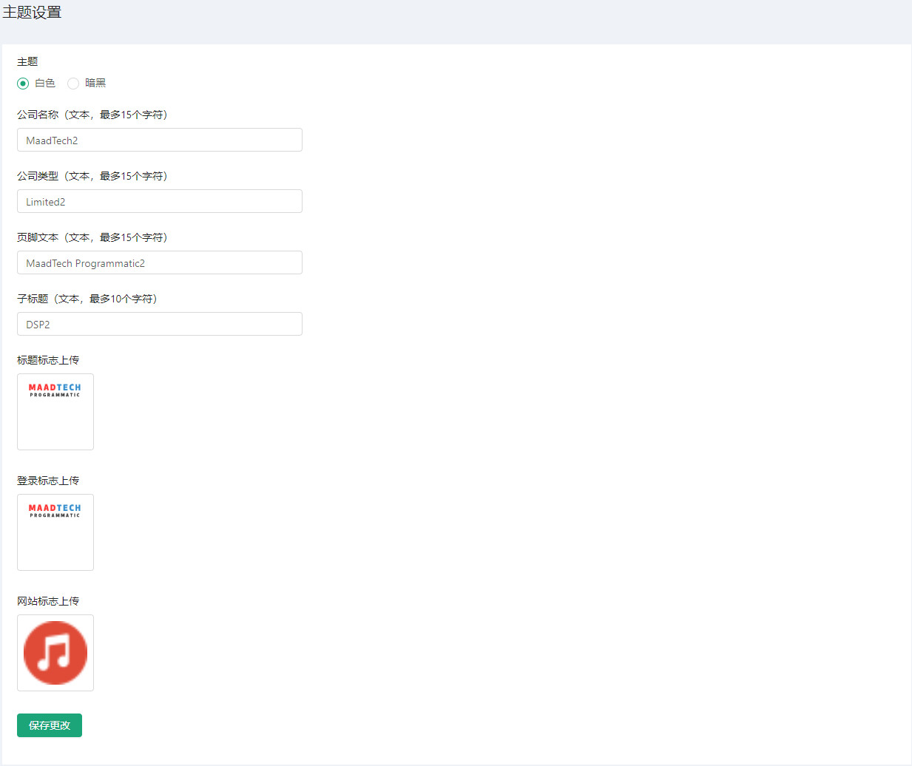
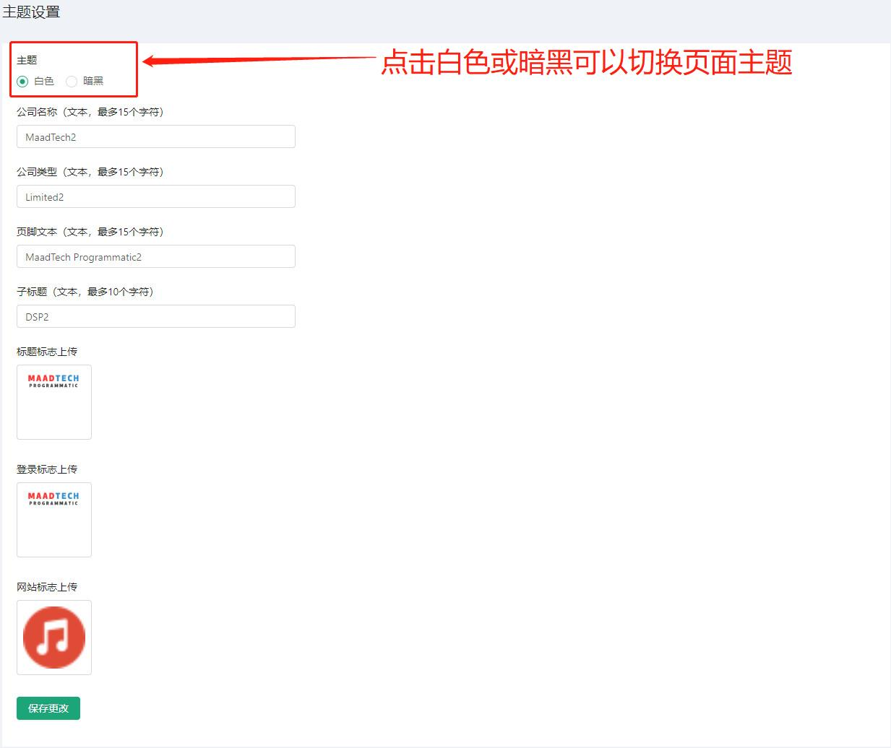
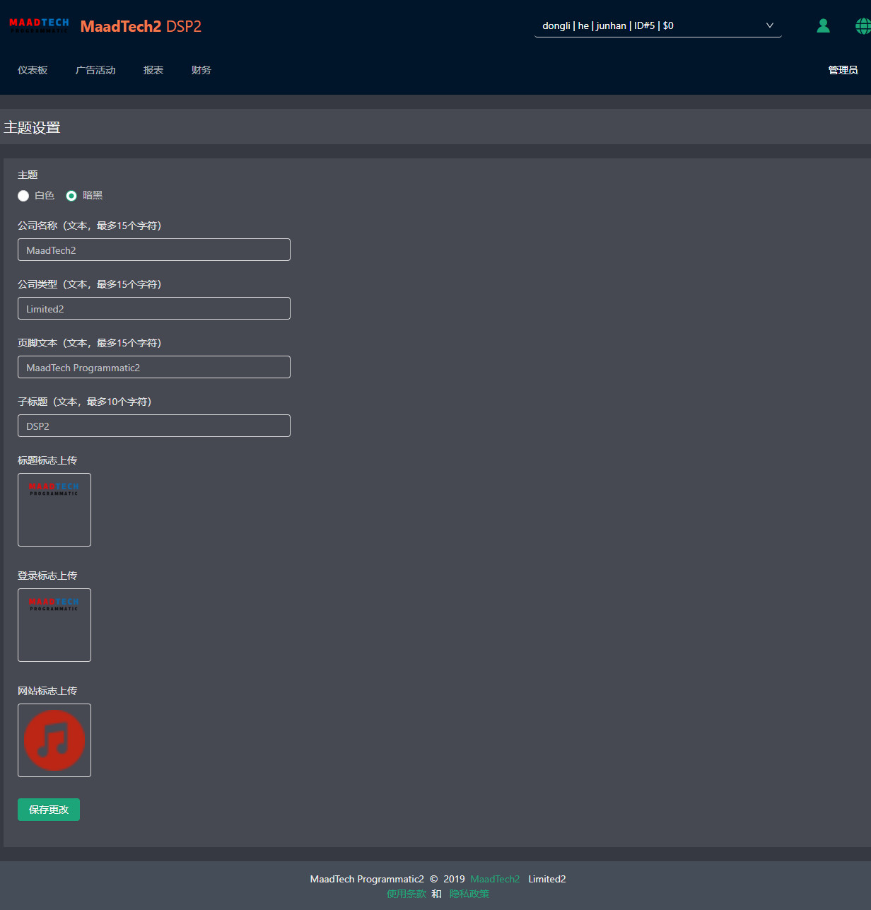
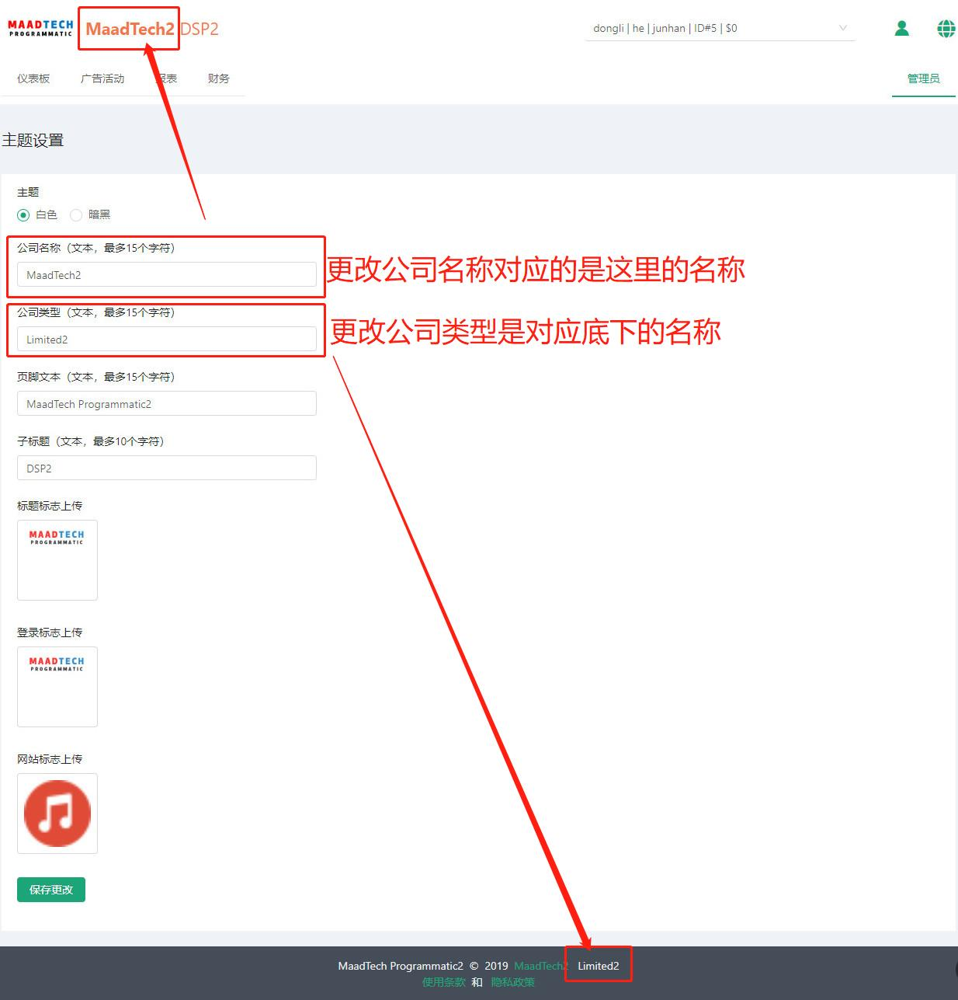
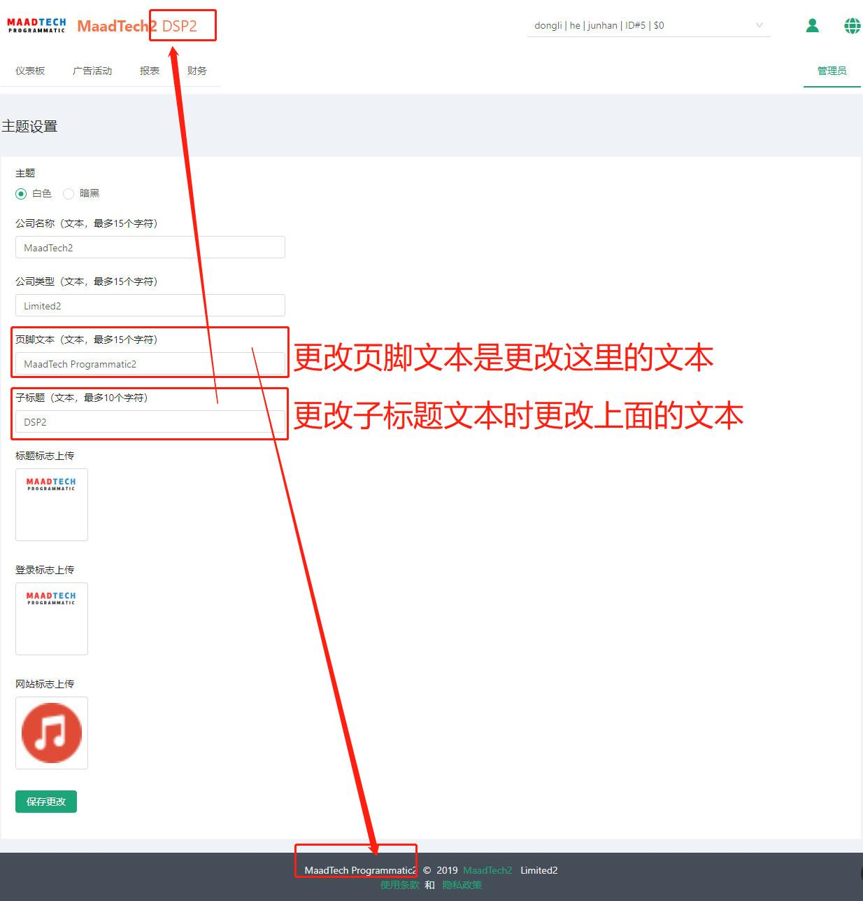
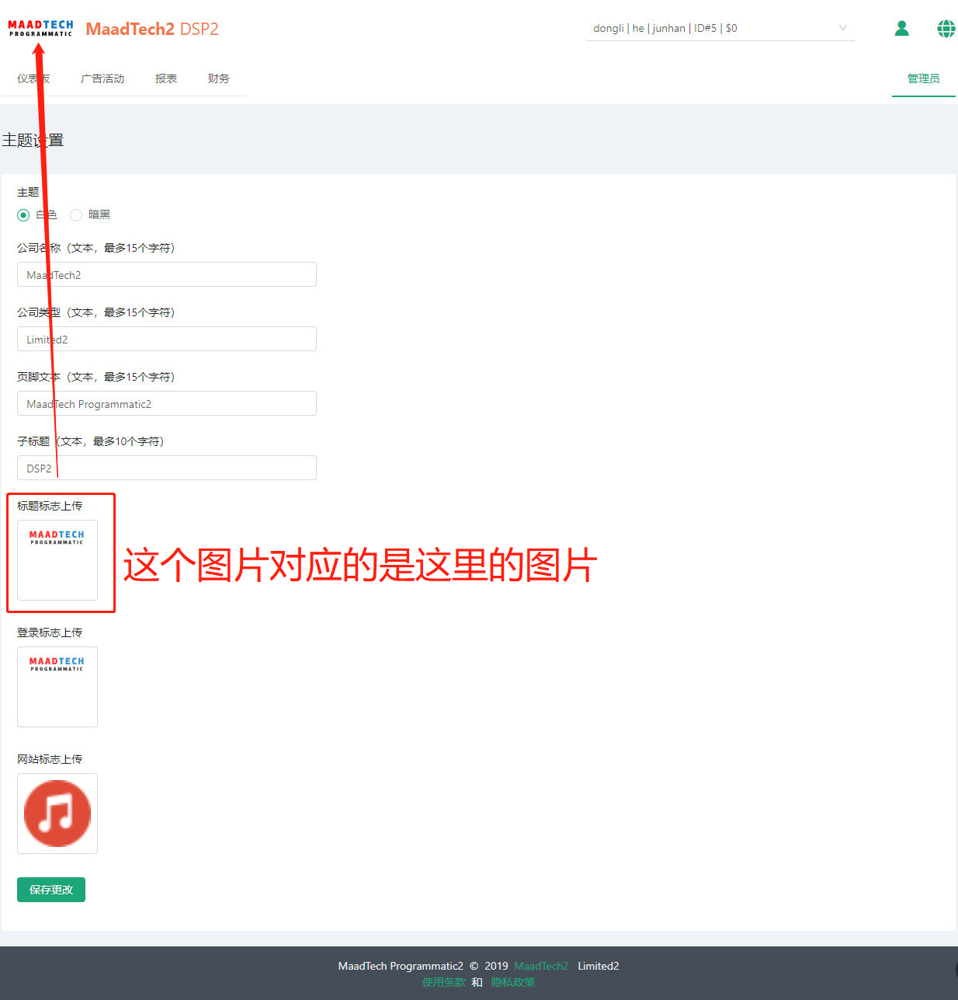
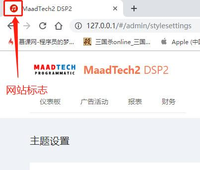
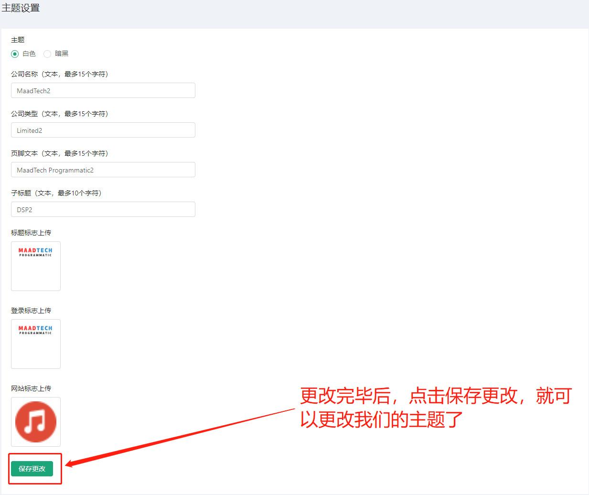

# 主题设置 #
------------------
::: tip 主题设置
* 主题设置是我们设置系统主题的模块
* 可以对公司类型、公司名称，标题标志，登录标志等进行更改设置
* 还可以切换白色及暗黑2种主题
:::

## 主题切换

* 暗黑主题效果

## 文本图片更改
::: tip 文本图片更改
* 可以对公司类型、公司名称进行更改设置
* 可以对子标题，页尾文本进行更改设置
* 可以对标题标志，登录标志以及网站标志进行更改设置
:::

#### 公司类型、公司名称进行更改设置

#### 子标题，页尾文本进行更改设置

#### 标题标志，登录标志以及网站标志进行更改设置

* 标题标志

* 登录标志

登录标志在登录界面的标志图片

* 网站标志

* 更改完毕后点击保存就可以对我们的主题进行设置了

