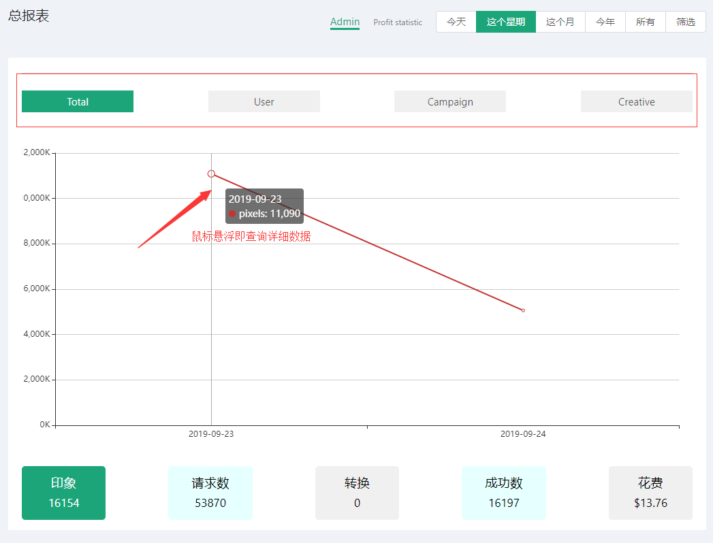
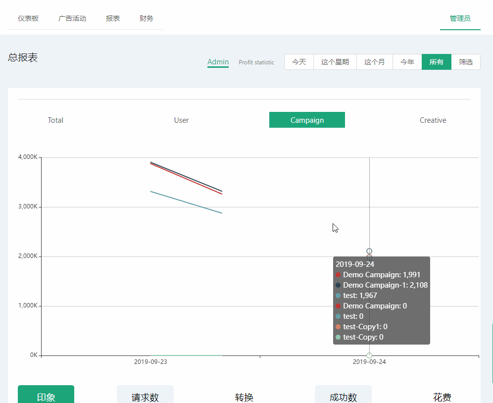

# 总表报 #
::: tip 展示广告/系列及用户等信息表报
* 此页面主要为管理员提供所有信息展示不仅包括广告还有用户信息等
* 此页面是在基本表报基础之上新增信息量及操作
:::

## 查看总报表
* 总表报查询会给予用户多种筛选，不仅有基本表报里的，还新增总数，用户，广告活动，广告系列；
* 图表折线图上下两方均可自由点击切换进行条件筛选数据；
* 筛选条件及按日期查询均同基础表报一样 [基础表报](/zh/UsersManual/reports/Reports.html#查看活动报表)

## 按表格形式查看总数据
* 点击上方 **Admin** 和 **Profit statistic** 进行切换；
* 表格会按每天日期为一行数据进行排序展示，点击上面按钮会呈现不同的数据信息；
* 表格中的最后一行是数据的统计的总和（如下图）：

