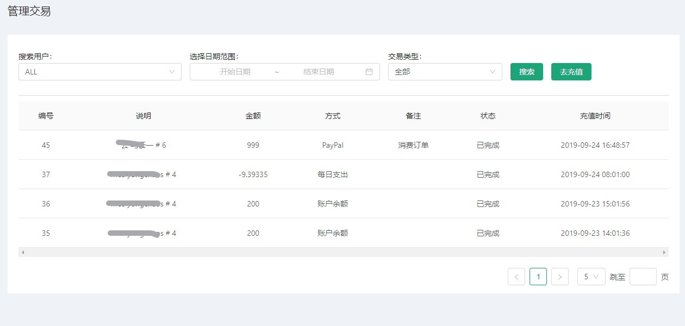
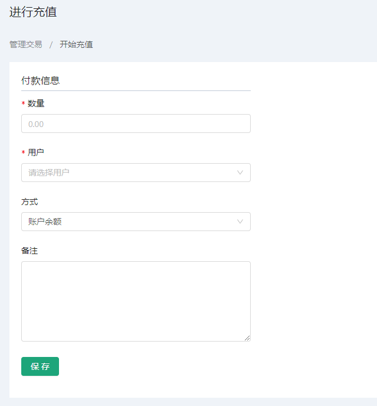

# 管理交易 #
::: tip 管理交易模块
* 此页面为管理提供快速查询用户账单，多种条件搭配查询，且提供充值功能
* 管理员能够找到自定义用户交易信息，方便于查看操作等...
:::

## 查看交易
* 查询交易功能主要用于用户能够快速查到该公司旗下所有交易情况；
* 查询时为用户提供多中添加完成用户指定筛选条点击查询即可，条件如下：
1. 指定用户 - 用于定位到某个用户的交易记录
2. 指定日期 - 可筛选出交易在什么时间段之内
3. 指定类型 - 用于筛选交易那些类型，例如：存款、兑现等...

## 充值
* 充值功能为管理员提供多种付款方式；
* 管理员指定用户进行余额充值;
* 步骤：点击充值图标  跳转充值页面，填入相关信息后，点击保存即可完成；

