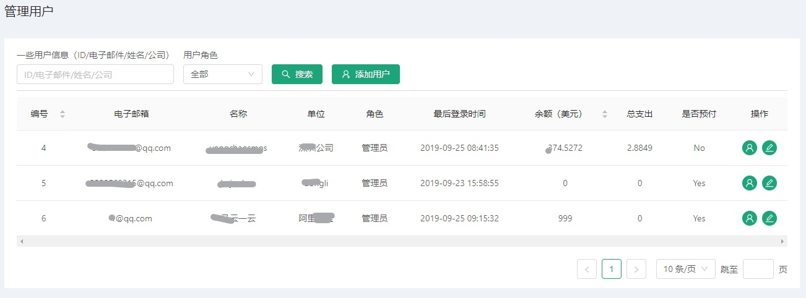
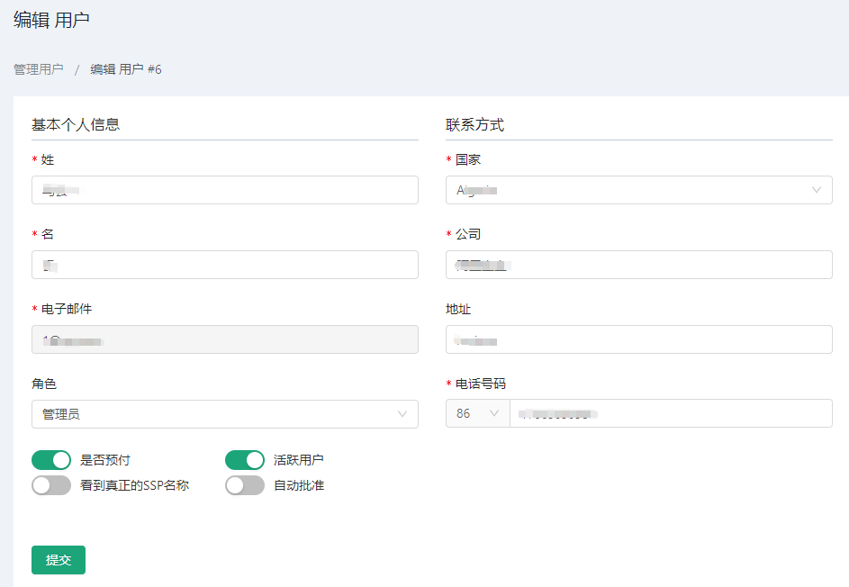

# 管理员用户操作 #
::: tip 管理所有用户相关信息
* 此页面为管理员提供用户新增，修改，查看等功能
* 管理员可任意条件查询指定用户，且提供方便，高效操作
:::

## 查看用户
* 关于查找用户我们为管理员提供多种条件搭配组合快速查询；
* 第一个输入可输入关于用户特征信息即可，比如：用户ID，或姓氏，名字，邮箱，公司名等...
* 第二个下拉框可是筛选是否管理员或普通用户，完成筛选之后点击查询即可;

## 新增用户
* 管理员可直接在本公司下新增人员，可免注册使用；
* 步骤：点击页面中新增用户按钮，跳转到添加页面，输入相关信息后，点击提交即可；

标记为红色星号为必填项

## 编辑用户
* 如有想修改一些用户信息可使用此功能，进行方便修改，步骤如下：
1. 在表格中选择你想要修改的用户，在最右边操作处；
2. 点击修改图标 跳转进行修改页；
3. 选择修改进行修改后，点击提交，即可完成修改流程；

## 查询某个用户下广告活动
* 管理员可切换到指定用户旗下的所有广告活动；
* 同编辑用户流程大致一致，点击表格某一行的用户图标切换 

