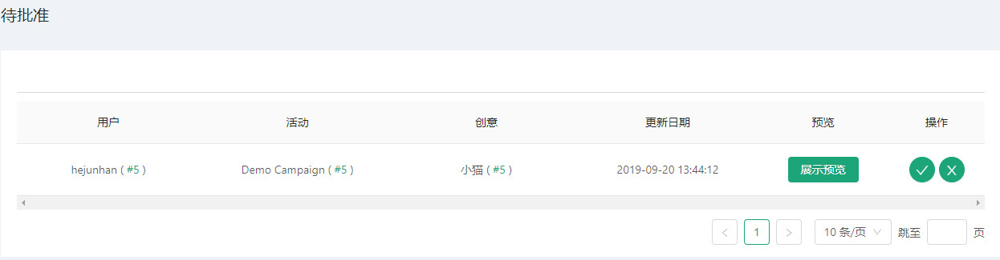

# 待审核 #
------------------
::: tip 待审核
* 待审核是我们批准广告资源的模块
* 添加广告系列后可以此模块看到待审核的广告系列
* 可以查看所有账号创建的待审核广告
* 我们初始时没有待审核广告的
:::

初始页面：

* 我们添加了广告系列或者复制了广告系列后便可在待审核中看到我们等待审核的广告了
* 关于广告系列信息请查看 [广告系列](/zh/UsersManual/bidder/Creative.html#添加广告系列)

## 操作待批准广告页面
::: tip 待批准页面操作
* 查看用户信息/广告活动详情/广告系列详情
* 预览广告活动
* 通过/拒绝审批广告
:::

### 查看用户信息
* 点击用户id，可查看用户个人信息

### 广告活动详情
* 点击广告活动id，可查看广告活动详情

### 广告系列详情
* 点击广告系列id，可查看广告系列详情

### 预览广告活动
* 点击展示预览按钮，出现广告预览弹窗，可查看广告预览详情

### 通过/拒绝审批广告
* 点击表格操作项的同意图标，即通过该广告审核

* 点击表格操作项的错误图标，即不同意通过该广告审核

::: tip 温馨提示
* 同意通过广告，其广告状态会从待审核更变成可执行
* 不同意通过广告，其广告状态会从待审核更变成有误
:::

