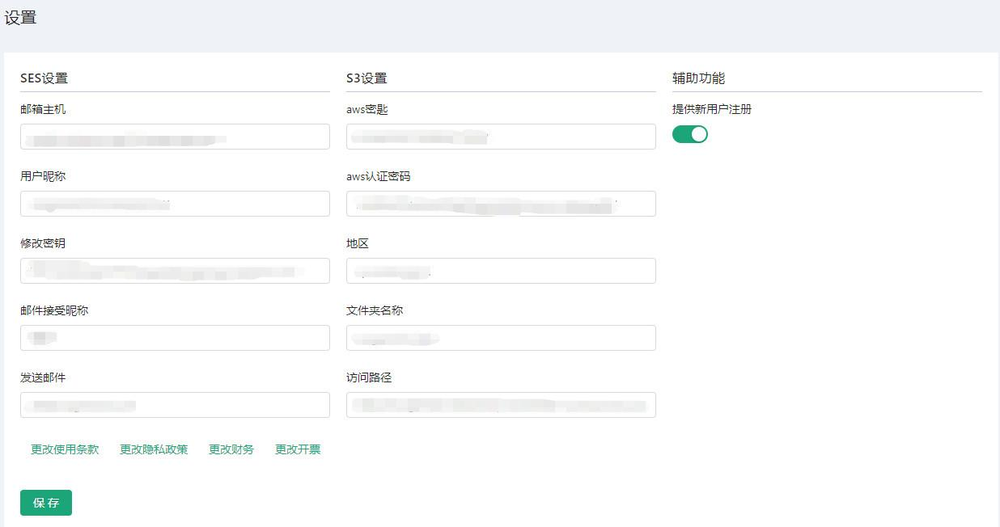
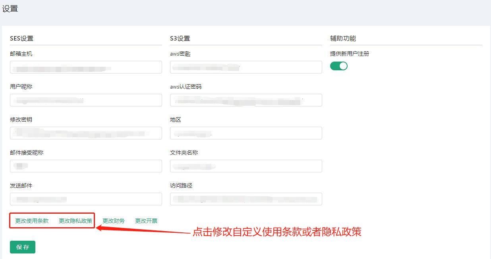
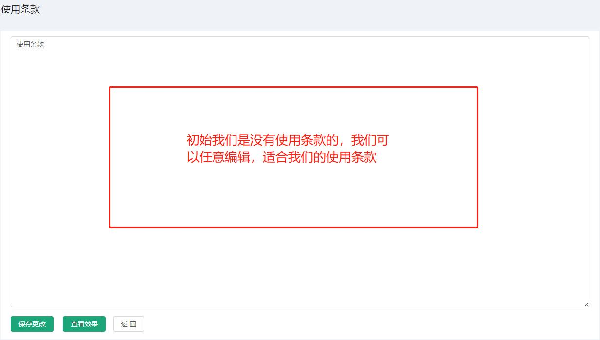
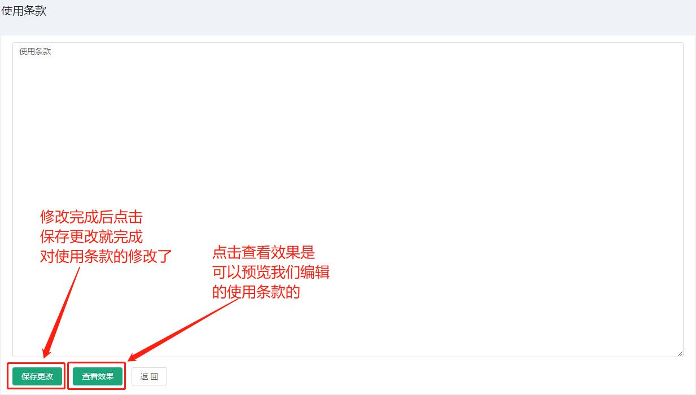
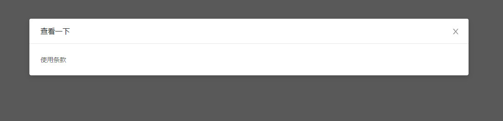
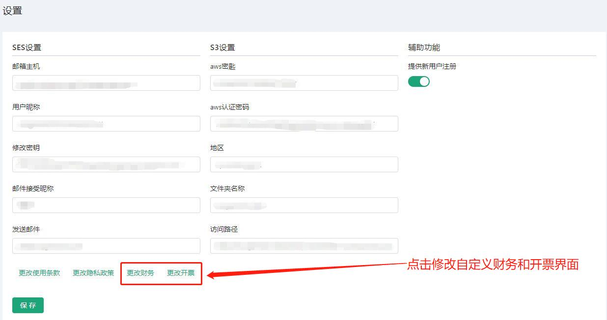
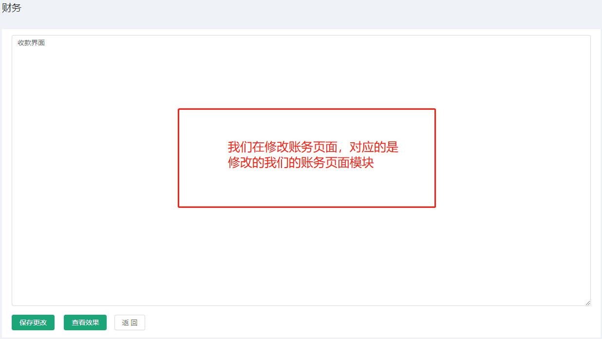
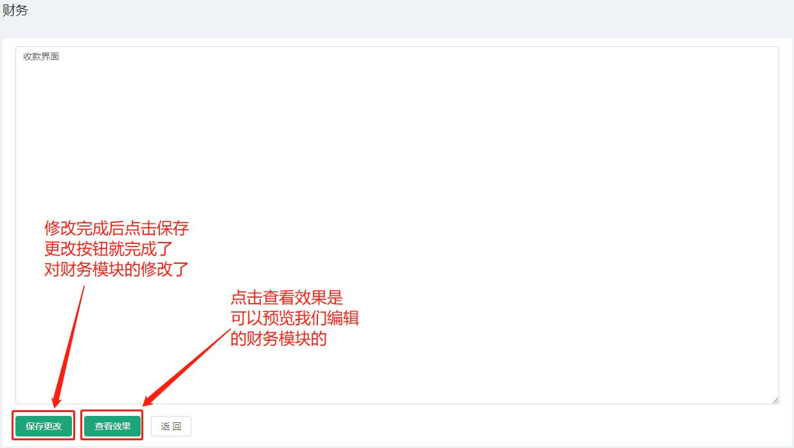
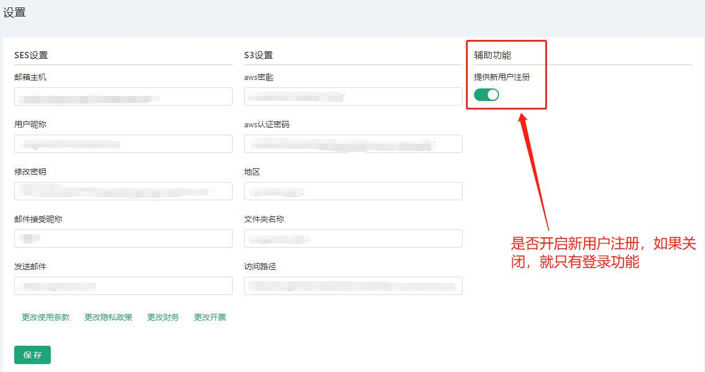
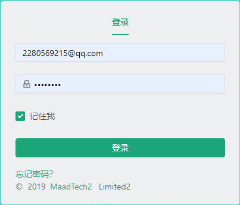

# 设置 #
------------------
::: tip 设置
* 设置是我们设置账户信息的模块
* 因为涉及到密钥等信息，所以页面做了模糊处理
:::

## 设置页面操作
::: tip 设置页面操作
* 更改使用条款/隐私政策
* 更改财务/开票
* 辅助功能
:::

## 更改使用条款/隐私政策

* 点击更改使用条款或者更改隐私政策后
* 会跳转到对应的编辑页面，进行更改、预览、保存

* 初始使用条款页面

* 我们可以进行修改，点击预览，最后保存更改即可

* 预览条款
* 点击查看效果按钮可以对编辑的条款进行预览

* 隐私政策的更改同使用条款的更改操作

## 更改财务/开票

* 点击更改财务或者更改开票后
* 会跳转到对应的编辑页面，进行更改、预览、保存

* 初始更改财务页面

* 我们可以进行修改，点击预览，最后保存更改即可

>* 关于财务模块信息请查看 [财务](/zh/UsersManual/billing/Billing.html#财务)
>* 开票模块的更改同财务的更改操作
>* 关于财务模块信息请查看 [开票](/zh/UsersManual/billing/Invoice.html#开票)

## 辅助功能
* 是否开启注册功能

* 如果关闭注册功能,将只能登录

